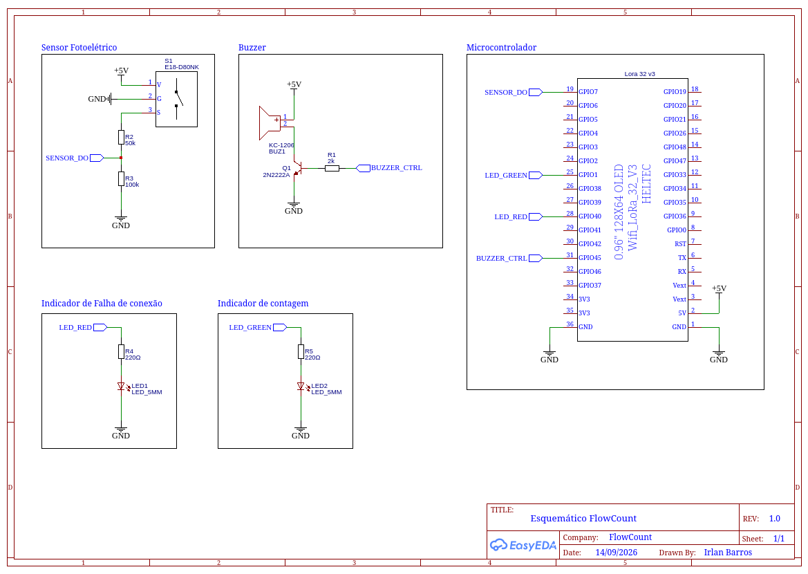
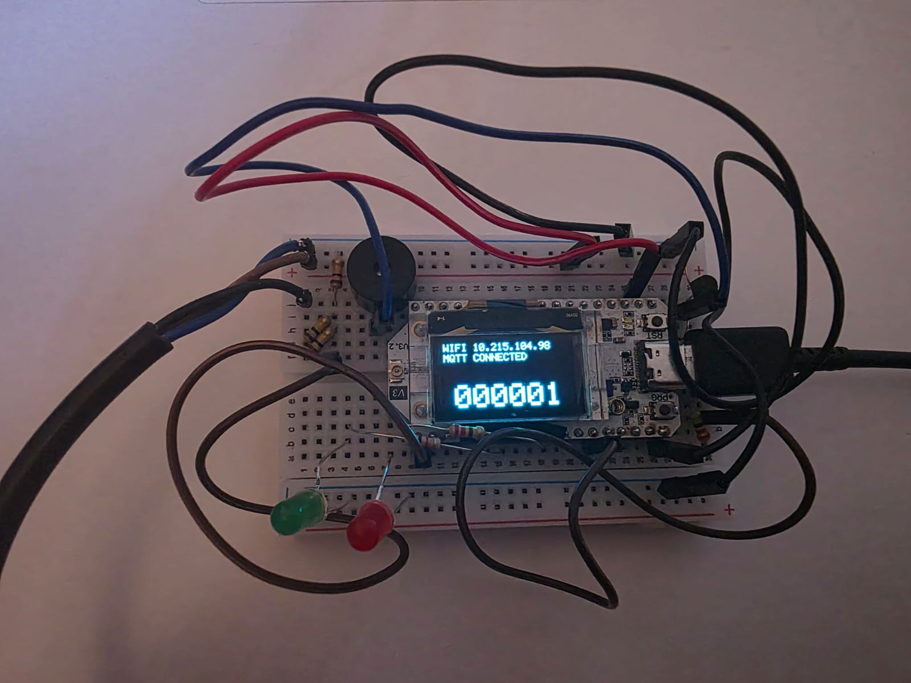
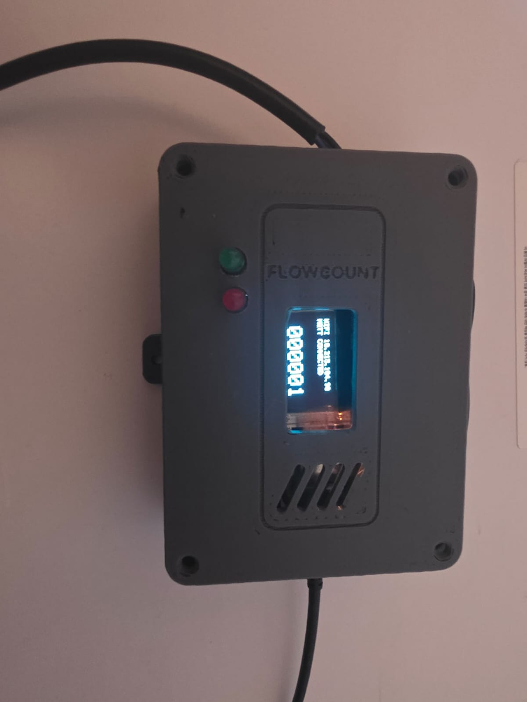
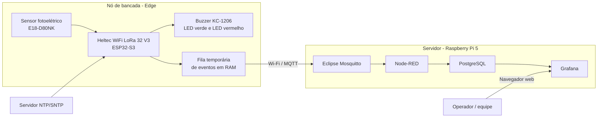
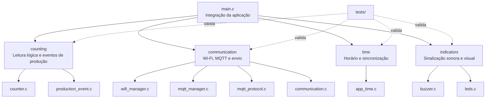
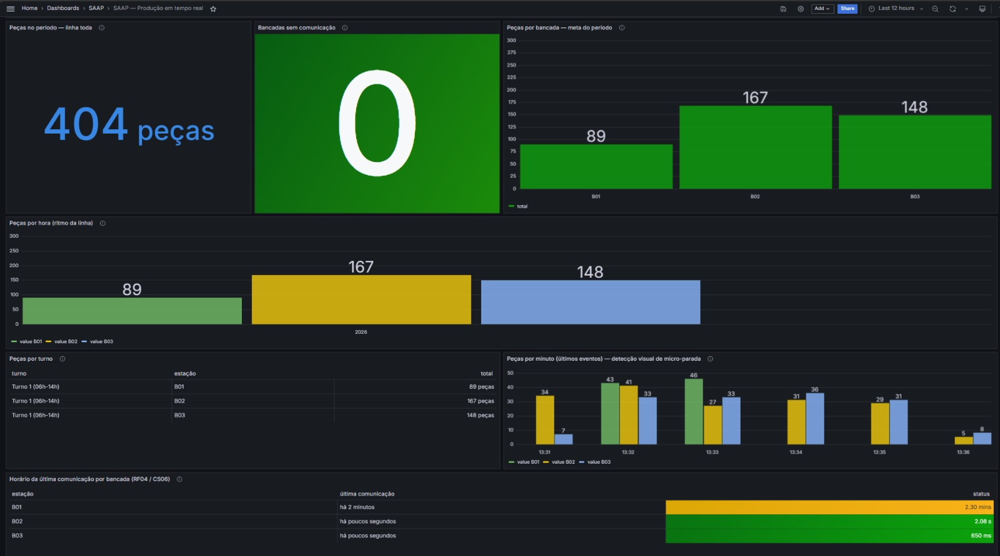

# FlowCount — Contagem automatizada de peças


O FlowCount foi desenvolvido para automatizar a contagem de peças que passam por um ponto de uma linha de produção ou esteira. A proposta é substituir contagens manuais ou soluções isoladas por um sistema simples de instalar, de baixo custo e capaz de disponibilizar os dados de produção em uma interface centralizada.

Cada ponto monitorado possui um **nó de bancada**. Esse nó contém o sensor fotoelétrico, a placa Heltec com ESP32-S3 e os componentes de sinalização. Quando uma peça atravessa o sensor, o firmware valida a passagem e gera um evento de produção.

Os eventos seguem para um servidor central, normalmente uma **Raspberry Pi 5**, onde são recebidos, armazenados e disponibilizados para visualização. O painel Grafana permite acompanhar informações de produção ao longo do tempo sem que o usuário precise interagir diretamente com o microcontrolador.

Em termos simples, o sistema pode ser entendido assim:

```text
Peça passa pelo sensor
        |
        v
ESP32 valida a passagem
        |
        v
Evento é enviado pela rede
        |
        v
Raspberry Pi recebe e armazena
        |
        v
Grafana apresenta os dados
```

## Materiais necessários

A tabela abaixo considera a reprodução de **uma estação de contagem** conectada a um servidor central. Para monitorar várias bancadas, replique os componentes marcados como "por estação".

| Item | Quantidade | Função | Observação |
|---|---:|---|---|
| Heltec WiFi LoRa 32 V3 | 1 por estação | Executar o firmware do FlowCount | Placa baseada em ESP32-S3; LoRa não é utilizado no fluxo atual |
| Sensor fotoelétrico E18-D80NK | 1 por estação | Detectar a passagem das peças | Entrada de contagem utilizada pelo firmware |
| Buzzer KC-1206 | 1 por estação | Sinalização sonora | Acionado por PWM através de transistor |
| Transistor NPN 2N2222A-1726 | 1 por estação | Acionamento do buzzer | Evita alimentar a carga diretamente pelo GPIO |
| Resistor 100 kΩ | 3 por estação | Interface do sensor | Valores utilizados no protótipo atual |
| Resistor 2 kΩ | 1 por estação | Interface do transistor/buzzer | Utilizado no comando do transistor |
| Resistor 220 Ω | 2 por estação | Limitação de corrente dos LEDs | Um resistor em série com cada LED; valor de referência do protótipo |
| LED verde | 1 por estação | Pulso em cada passagem válida | GPIO 1 por padrão |
| LED vermelho | 1 por estação | Indicar Wi-Fi ou MQTT desconectado | GPIO 40 por padrão |
| Protoboard ou placa de montagem | 1 por estação | Montagem do circuito | Para protótipo; em versão final pode ser substituída por PCB |
| Jumpers/fios de conexão | Conforme necessário | Interligação elétrica | Macho-macho, macho-fêmea ou conforme a montagem |
| Cabo USB de dados para a Heltec | 1 por estação | Alimentação, gravação e monitor serial | Deve permitir transferência de dados |
| Fonte/linha de 5 V adequada | 1 por estação | Alimentar os componentes de 5 V | Utilizar GND comum entre os elementos da estação |
| Diodo de proteção para carga indutiva | 1 por estação | Proteção do acionamento do buzzer | Recomendado para a montagem final; dimensionar conforme o componente usado |
| Esteira ou estrutura de passagem | 1 | Movimentar as peças pelo ponto de leitura | Pode ser substituída por passagem manual durante testes |
| Raspberry Pi 5 | 1 por instalação | Executar o servidor central | Um único servidor pode atender várias estações |
| Fonte USB-C 27 W para Raspberry Pi 5 | 1 | Alimentar a Raspberry Pi | A documentação do servidor recomenda fonte adequada à Pi 5 |
| Cooler ativo para Raspberry Pi 5 | 1 | Refrigeração | Recomendado para operação contínua |
| Cartão microSD A2/V30 de 128 GB | 1 | Sistema operacional e dados da Raspberry Pi | Configuração de referência do servidor; SSD USB é uma alternativa para uso contínuo |
| Roteador ou ponto de acesso Wi-Fi | 1 | Comunicação entre ESP32 e servidor | O ESP32 e a Raspberry precisam alcançar a mesma infraestrutura de rede |
| Computador de desenvolvimento | 1 | Compilar e gravar o firmware | Linux é o ambiente descrito neste README |

Consulte as ligações elétricas no [guia de hardware e montagem](docs/hardware.md).

## Esquemático elétrico da estação de contagem



## Montagem do protótipo

A estação reúne a placa de controle, a interface do sensor e os componentes de sinalização. As imagens mostram a montagem em protoboard e o conjunto instalado no gabinete desenvolvido para o projeto.

| Montagem em protoboard | Montagem no gabinete |
|:---:|:---:|
|  |  |

Os principais componentes são a Heltec, o sensor E18-D80NK, o buzzer KC-1206, os LEDs verde e vermelho, o transistor de acionamento e os resistores. A lista completa de materiais, a pinagem e as orientações de alimentação estão no [guia de hardware e montagem](docs/hardware.md).

## Tecnologias e versões

### Firmware

| Tecnologia / componente | Versão usada pelo projeto | Situação |
|---|---|---|
| ESP-IDF | **5.5.5** | Versão verificada pelo projeto e fixada na CI |
| Target ESP-IDF | **esp32s3** | Obrigatório para a placa utilizada |
| Linguagem | **C11** | Os testes de host são compilados com `-std=c11` |
| CMake | **3.16 ou superior** | Versão mínima definida no `CMakeLists.txt` |
| FreeRTOS | Incluído no ESP-IDF 5.5.5 | Não possui versão independente fixada neste repositório |
| ESP-MQTT | Incluído no ESP-IDF 5.5.5 | Usado para comunicação MQTT |
| esp_wifi / esp_netif | Incluídos no ESP-IDF 5.5.5 | Conectividade Wi-Fi |
| esp_timer | Incluído no ESP-IDF 5.5.5 | Temporização da aplicação |
| esp_driver_gpio | Incluído no ESP-IDF 5.5.5 | Entrada do sensor |
| esp_driver_ledc | Incluído no ESP-IDF 5.5.5 | PWM do buzzer |
| cJSON | Incluído no ESP-IDF 5.5.5 | Serialização e testes do protocolo |
| lwIP/SNTP | Incluído no ESP-IDF 5.5.5 | Sincronização de horário |
| GitHub Actions runner | **Ubuntu 24.04** | Ambiente atual da suíte de CI |
| Imagem de CI do firmware | **espressif/idf:v5.5.5** | Build automatizado do ESP32-S3 |
| actions/checkout | **v4** | Usado pelo workflow de CI |

### Servidor

O servidor está definido no repositório [Grafana_Dashboards, revisão de referência `6359597`](https://github.com/ValdimiroAlves/Grafana_Dashboards/tree/6359597918faf1b41a83b39492e5ba1cee65c281).

| Serviço | Tag configurada |
|---|---|
| Eclipse Mosquitto | `eclipse-mosquitto:2` |
| PostgreSQL | `postgres:16.15-alpine` |
| Node-RED | `nodered/node-red:5.0.7` + `node-red-contrib-postgresql@0.16.2` |
| Grafana OSS | `grafana/grafana-oss:11.2.0` |
| Sistema operacional recomendado | Raspberry Pi OS Lite 64-bit |
| Orquestração | Docker Engine + Docker Compose plugin |

### Observação sobre reprodutibilidade

O firmware está fixado em ESP-IDF 5.5.5. No servidor, a versão do Grafana está fixada em `11.2.0`, mas a tag `2` do Mosquitto não fixa um patch específico. PostgreSQL (`16.15-alpine`) e Node-RED (`5.0.7`) têm versões explícitas na revisão de referência; as imagens não estão fixadas por digest.

Para uma implantação totalmente reprodutível, recomenda-se futuramente substituir essas tags por versões completas ou por digests de imagem Docker.

Também não há uma versão exata de Docker Engine, Docker Compose, Raspberry Pi OS ou `paho-mqtt` fixada pelo projeto neste momento. O README não atribui versões que o código não define.

## Como reproduzir

Consulte o [guia de instalação](docs/instalacao.md) para preparar o servidor, configurar o firmware, compilar, gravar e verificar o sistema completo.

## Como o sistema funciona

O FlowCount é dividido em duas partes principais.

### Nó de bancada

O nó de bancada é responsável por interagir com o processo físico. Ele utiliza:

- sensor fotoelétrico E18-D80NK para detectar a passagem da peça;
- Heltec WiFi LoRa 32 V3, baseada em ESP32-S3, para executar o firmware;
- buzzer KC-1206 para sinalização sonora;
- LED verde para indicar cada passagem válida;
- LED vermelho aceso enquanto Wi-Fi ou MQTT estiver desconectado;
- circuito com transistor e resistores para interfacear corretamente os componentes.

O firmware executa continuamente a leitura do sensor, identifica uma passagem válida, registra o evento e tenta encaminhá-lo ao servidor.

### Servidor

O servidor é executado em uma Raspberry Pi 5 ou, para desenvolvimento, em outro computador compatível com Docker.

Ele utiliza quatro serviços principais:

1. **Mosquitto** recebe os eventos enviados pelos nós de bancada;
2. **Node-RED** processa os eventos recebidos;
3. **PostgreSQL** armazena o histórico de produção;
4. **Grafana** apresenta os dados em dashboards.

O servidor usado pelo FlowCount é mantido separadamente no repositório:

```text
https://github.com/ValdimiroAlves/Grafana_Dashboards
```

Isso significa que clonar apenas este repositório fornece o firmware do nó de bancada, mas não instala automaticamente o servidor da Raspberry Pi.

## Arquitetura

A solução segue uma arquitetura distribuída de **edge computing + servidor de supervisão**.

O processamento diretamente relacionado ao sensor acontece no ESP32-S3, próximo ao processo físico. A Raspberry Pi concentra os serviços de comunicação, armazenamento e visualização.



### Fluxo dos dados

```text
E18-D80NK
    |
    v
GPIO 7 da Heltec
    |
    v
Validação da passagem
    |
    v
Evento de produção
    |
    v
Fila em RAM do ESP32
    |
    v
Wi-Fi / MQTT
    |
    v
Mosquitto
    |
    v
Node-RED
    |
    v
PostgreSQL
    |
    v
Grafana
```

## Configurações principais

Os parâmetros abaixo estão definidos em `main/Kconfig.projbuild`.

| Configuração | Padrão | Uso |
|---|---:|---|
| `FLOWCOUNT_STATION_ID` | `1` | Identificador numérico da estação |
| `FLOWCOUNT_EVENT_QUEUE_CAPACITY` | `72` | Quantidade de eventos mantidos temporariamente em RAM |
| `FLOWCOUNT_BANCADA` | `B01` | Nome lógico da bancada |
| `FLOWCOUNT_NTP_SERVER` | `pool.ntp.org` | Fonte de sincronização de horário |
| `FLOWCOUNT_CLOCK_MAX_AGE_SECONDS` | `86400` | Tempo máximo de validade da referência de horário |
| `FLOWCOUNT_COMM_ENABLED` | `y` | Habilita comunicação do nó |
| `FLOWCOUNT_WIFI_SSID` | vazio | Nome da rede Wi-Fi |
| `FLOWCOUNT_WIFI_PASSWORD` | vazio | Senha da rede Wi-Fi |
| `FLOWCOUNT_MQTT_URI` | vazio | Endereço do broker MQTT |
| `FLOWCOUNT_MQTT_USERNAME` | vazio | Usuário MQTT, quando aplicável |
| `FLOWCOUNT_MQTT_PASSWORD` | vazio | Senha MQTT, quando aplicável |
| `FLOWCOUNT_WIFI_RETRY_SECONDS` | `5` | Intervalo entre tentativas de reconexão Wi-Fi |
| `FLOWCOUNT_BUZZER_GPIO` | `45` | GPIO que comanda o circuito do buzzer |
| `FLOWCOUNT_BUZZER_FREQUENCY_HZ` | `2400` | Frequência de PWM do buzzer |
| `FLOWCOUNT_LED_GREEN_GPIO` | `1` | GPIO do LED verde de contagem |
| `FLOWCOUNT_LED_RED_GPIO` | `40` | GPIO do LED vermelho de conectividade |
| `FLOWCOUNT_LED_PULSE_MS` | `100` | Duração do pulso verde em milissegundos |

O `Kconfig` também possui opções reservadas para prefixo de tópico, heartbeat e timeout de ACK. Na versão atual analisada, essas opções não representam integralmente o fluxo ativo de publicação e não devem ser tratadas como interface estável até que a documentação do módulo de comunicação seja concluída.

## Estrutura do repositório

A organização principal do firmware é modular. Headers públicos ficam em `main/include` e implementações em `main/src`.

```text
FlowCount/
├── .github/
│   └── workflows/
│       └── ci.yml
├── assets/
│   └── demo/
│       ├── flowcount-demo.gif
│       ├── flowcount-demonstracao-contagem.gif
│       ├── flowcount-prototipo-protoboard.jpeg
│       ├── flowcount-montagem-gabinete.jpeg
│       └── flowcount-dashboard-grafana.jpeg
├── docs/                               # documentação complementar
│   ├── instalacao.md
│   ├── materiais.md
│   ├── hardware.md
│   ├── raspberry.md
│   └── buzzer.md
├── main/
│   ├── CMakeLists.txt
│   ├── Kconfig.projbuild
│   ├── include/
│   │   ├── communication/
│   │   │   ├── communication.h
│   │   │   ├── mqtt_manager.h
│   │   │   ├── mqtt_protocol.h
│   │   │   └── wifi_manager.h
│   │   ├── counting/
│   │   │   ├── counter.h
│   │   │   └── production_event.h
│   │   ├── indicators/
│   │   │   ├── buzzer.h
│   │   │   └── leds.h
│   │   └── time/
│   │       └── app_time.h
│   └── src/
│       ├── main.c
│       ├── communication/
│       │   ├── communication.c
│       │   ├── mqtt_manager.c
│       │   ├── mqtt_protocol.c
│       │   └── wifi_manager.c
│       ├── counting/
│       │   ├── counter.c
│       │   └── production_event.c
│       ├── indicators/
│       │   ├── buzzer.c
│       │   └── leds.c
│       └── time/
│           └── app_time.c
├── tests/
│   ├── run_tests.sh
│   ├── test_counter.c
│   ├── test_production_event.c
│   ├── test_communication.c
│   ├── test_mqtt_protocol.c
│   ├── test_network_alerts.c
│   ├── test_buzzer.c
│   ├── test_leds.c
│   └── test_app_time.c
├── CMakeLists.txt
├── .clangd
├── .gitignore
└── README.md
```

### Organização lógica



## Demonstração da contagem

A demonstração abaixo mostra a contagem de peças em funcionamento.


## Acompanhamento da produção

O painel principal reúne o total de peças no período, a produção por bancada, os indicadores por hora e turno e o estado de comunicação das estações. Os gráficos permitem observar o ritmo de produção e identificar intervalos sem novos registros.



## Testes e integração contínua

Consulte o [guia de testes](tests/README.md) para instalar as dependências, executar a suíte localmente e com sanitizers e entender a integração contínua.

## Boas práticas de segurança

Para desenvolvimento em bancada, a infraestrutura pode utilizar configurações simplificadas. Antes de qualquer implantação fora de uma rede controlada:

- não versione SSID, senha Wi-Fi ou outras credenciais;
- não publique `sdkconfig` contendo credenciais;
- altere a senha padrão do Grafana;
- habilite autenticação no Mosquitto;
- habilite autenticação no banco de dados quando aplicável;
- não exponha diretamente as portas MQTT e PostgreSQL à internet;
- utilize uma rede privada, VPN ou solução equivalente para acesso remoto;
- mantenha Raspberry Pi, Docker e imagens de container atualizados;
- utilize fonte adequada e proteção elétrica compatível com o ambiente da instalação.

## Documentação detalhada

Este README reúne a apresentação, a arquitetura e o funcionamento do sistema. Os guias de instalação, materiais e testes e os detalhes de implementação estão nos documentos abaixo.

| Documento | Caminho | Conteúdo esperado |
|---|---|---|
| Instalação | [docs/instalacao.md](docs/instalacao.md) | Preparação, configuração e execução do sistema |
| Lista de materiais | [docs/materiais.md](docs/materiais.md) | Componentes, quantidades e funções |
| Visão detalhada do firmware | [main/README.md](main/README.md) | Inicialização, responsabilidades e integração dos módulos |
| Contagem e geração de eventos | [main/src/counting/README.md](main/src/counting/README.md) | Máquina de estados, filtros e fila de produção |
| Comunicação | [main/src/communication/README.md](main/src/communication/README.md) | Wi-Fi, MQTT, formato das mensagens e entrega |
| Sinalização | [main/src/indicators/README.md](main/src/indicators/README.md) | Buzzer, LEDs e estados de sinalização |
| Horário | [main/src/time/README.md](main/src/time/README.md) | SNTP, timestamps e validade do relógio |
| Hardware e montagem | [docs/hardware.md](docs/hardware.md) | Esquemático, pinagem, alimentação e montagem física |
| Buzzer KC-1206 | [docs/buzzer.md](docs/buzzer.md) | Funcionamento e validação do circuito do buzzer |
| Raspberry Pi / servidor | [docs/raspberry.md](docs/raspberry.md) | Preparação da Raspberry e integração com o servidor |
| Testes | [tests/README.md](tests/README.md) | Como executar e interpretar a suíte de testes |

## Equipe

- Francisco Irlan de Oliveira Barros
- Valney Maia Neto
- Valdimiro Alves dos Santos Neto
- João Henrique de Brito Leandro Bitu Corrêa

---

FlowCount é um protótipo de automação industrial voltado à contagem de peças e acompanhamento de produção, combinando sensoriamento em edge, comunicação em rede e visualização centralizada de dados.
