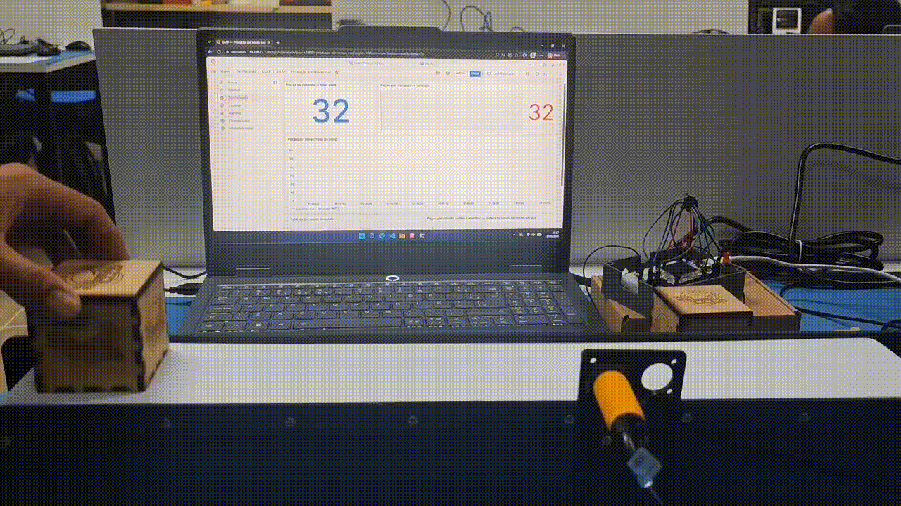
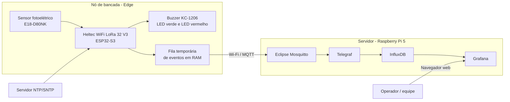
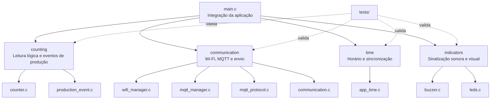
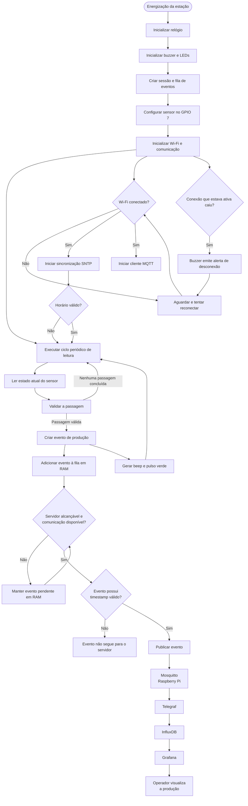

# FlowCount

Sistema de contagem automatizada de peças para ambientes industriais, composto por um nó de bancada baseado em ESP32-S3 e por um servidor de supervisão executado em Raspberry Pi 5.

O FlowCount detecta a passagem de peças por um sensor fotoelétrico, registra cada passagem válida, envia os eventos pela rede Wi-Fi e apresenta os dados em dashboards no Grafana. O sistema também fornece sinalização local por buzzer e LEDs independentes e mantém uma fila temporária de eventos no microcontrolador para lidar com indisponibilidades momentâneas de comunicação.

A implementação atual utiliza a placa **Heltec WiFi LoRa 32 V3**, porém a comunicação usada pelo firmware neste estágio é **Wi-Fi + MQTT**. O rádio LoRa da placa não faz parte do fluxo atual do sistema.

## Demonstração



## Sumário

- [Visão geral](#visão-geral)
- [Como o sistema funciona](#como-o-sistema-funciona)
- [Arquitetura](#arquitetura)
- [Materiais necessários](#materiais-necessários)
- [Tecnologias e versões](#tecnologias-e-versões)
- [Estrutura do repositório](#estrutura-do-repositório)
- [Documentação detalhada](#documentação-detalhada)
- [Como executar o projeto](#como-executar-o-projeto)
  - [1. Preparar o servidor](#1-preparar-o-servidor)
  - [2. Preparar o ambiente do firmware](#2-preparar-o-ambiente-do-firmware)
  - [3. Configurar o firmware](#3-configurar-o-firmware)
  - [4. Compilar e gravar a Heltec](#4-compilar-e-gravar-a-heltec)
  - [5. Verificar o sistema completo](#5-verificar-o-sistema-completo)
- [Configurações principais](#configurações-principais)
- [Fluxo completo de execução](#fluxo-completo-de-execução)
- [Testes e integração contínua](#testes-e-integração-contínua)
- [Estado atual e limitações](#estado-atual-e-limitações)
- [Boas práticas de segurança](#boas-práticas-de-segurança)
- [Equipe](#equipe)

## Visão geral

O FlowCount foi desenvolvido para automatizar a contagem de peças que passam por um ponto de uma linha de produção ou esteira. A proposta é substituir contagens manuais ou soluções isoladas por um sistema simples de instalar, de baixo custo e capaz de disponibilizar os dados de produção em uma interface centralizada.

Cada ponto monitorado possui um **nó de bancada**. Esse nó contém o sensor fotoelétrico, a placa Heltec com ESP32-S3 e os componentes de sinalização. Quando uma peça atravessa o sensor, o firmware valida a passagem e gera um evento de produção.

Os eventos seguem para um servidor central, normalmente uma **Raspberry Pi 5**, onde são recebidos, armazenados e disponibilizados para visualização. O painel Grafana permite acompanhar informações de produção ao longo do tempo sem que o usuário precise interagir diretamente com o microcontrolador.

Em termos simples, o sistema pode ser entendido assim:

```text
Peça passa pelo sensor
        |
        v
ESP32 valida a passagem
        |
        v
Evento é enviado pela rede
        |
        v
Raspberry Pi recebe e armazena
        |
        v
Grafana apresenta os dados
```

## Como o sistema funciona

O FlowCount é dividido em duas partes principais.

### Nó de bancada

O nó de bancada é responsável por interagir com o processo físico. Ele utiliza:

- sensor fotoelétrico E18-D80NK para detectar a passagem da peça;
- Heltec WiFi LoRa 32 V3, baseada em ESP32-S3, para executar o firmware;
- buzzer KC-1206 para sinalização sonora;
- LED verde para indicar cada passagem válida;
- LED vermelho aceso enquanto Wi-Fi ou MQTT estiver desconectado;
- circuito com transistor e resistores para interfacear corretamente os componentes.

O firmware executa continuamente a leitura do sensor, identifica uma passagem válida, registra o evento e tenta encaminhá-lo ao servidor.

### Servidor

O servidor é executado em uma Raspberry Pi 5 ou, para desenvolvimento, em outro computador compatível com Docker.

Ele utiliza quatro serviços principais:

1. **Mosquitto** recebe os eventos enviados pelos nós de bancada;
2. **Telegraf** processa os eventos recebidos;
3. **InfluxDB** armazena o histórico de produção;
4. **Grafana** apresenta os dados em dashboards.

O servidor usado pelo FlowCount é mantido separadamente no repositório:

```text
https://github.com/ValdimiroAlves/Grafana_Dashboards
```

Isso significa que clonar apenas este repositório fornece o firmware do nó de bancada, mas não instala automaticamente o servidor da Raspberry Pi.

## Arquitetura

A solução segue uma arquitetura distribuída de **edge computing + servidor de supervisão**.

O processamento diretamente relacionado ao sensor acontece no ESP32-S3, próximo ao processo físico. A Raspberry Pi concentra os serviços de comunicação, armazenamento e visualização.



### Responsabilidades por camada

| Camada | Responsabilidade |
|---|---|
| Sensor | Detectar fisicamente a presença/passagem de uma peça |
| ESP32-S3 | Validar a leitura, gerar eventos, controlar sinalização e comunicação |
| Wi-Fi | Interligar o nó de bancada ao servidor |
| Mosquitto | Receber as mensagens dos nós de bancada |
| Telegraf | Transformar e encaminhar os dados recebidos |
| InfluxDB | Manter o histórico temporal da produção |
| Grafana | Exibir os dados em dashboards |

Detalhes internos de contagem, protocolo MQTT, sincronização de horário e sinalização ficam nas documentações específicas dos módulos, evitando transformar este README em uma especificação de implementação.

## Materiais necessários

A tabela abaixo considera a reprodução de **uma estação de contagem** conectada a um servidor central. Para monitorar várias bancadas, replique os componentes marcados como "por estação".

| Item | Quantidade | Função | Observação |
|---|---:|---|---|
| Heltec WiFi LoRa 32 V3 | 1 por estação | Executar o firmware do FlowCount | Placa baseada em ESP32-S3; LoRa não é utilizado no fluxo atual |
| Sensor fotoelétrico E18-D80NK | 1 por estação | Detectar a passagem das peças | Entrada de contagem utilizada pelo firmware |
| Buzzer KC-1206 | 1 por estação | Sinalização sonora | Acionado por PWM através de transistor |
| Transistor NPN 2N2222A-1726 | 1 por estação | Acionamento do buzzer | Evita alimentar a carga diretamente pelo GPIO |
| Resistor 100 kΩ | 3 por estação | Interface do sensor | Valores utilizados no protótipo atual |
| Resistor 2 kΩ | 1 por estação | Interface do transistor/buzzer | Utilizado no comando do transistor |
| Resistor 220 Ω | 2 por estação | Limitação de corrente dos LEDs | Um resistor em série com cada LED; valor de referência do protótipo |
| LED verde | 1 por estação | Pulso em cada passagem válida | GPIO 1 por padrão |
| LED vermelho | 1 por estação | Indicar Wi-Fi ou MQTT desconectado | GPIO 40 por padrão |
| Protoboard ou placa de montagem | 1 por estação | Montagem do circuito | Para protótipo; em versão final pode ser substituída por PCB |
| Jumpers/fios de conexão | Conforme necessário | Interligação elétrica | Macho-macho, macho-fêmea ou conforme a montagem |
| Cabo USB de dados para a Heltec | 1 por estação | Alimentação, gravação e monitor serial | Deve permitir transferência de dados |
| Fonte/linha de 5 V adequada | 1 por estação | Alimentar os componentes de 5 V | Utilizar GND comum entre os elementos da estação |
| Diodo de proteção para carga indutiva | 1 por estação | Proteção do acionamento do buzzer | Recomendado para a montagem final; dimensionar conforme o componente usado |
| Esteira ou estrutura de passagem | 1 | Movimentar as peças pelo ponto de leitura | Pode ser substituída por passagem manual durante testes |
| Raspberry Pi 5 | 1 por instalação | Executar o servidor central | Um único servidor pode atender várias estações |
| Fonte USB-C 27 W para Raspberry Pi 5 | 1 | Alimentar a Raspberry Pi | A documentação do servidor recomenda fonte adequada à Pi 5 |
| Cooler ativo para Raspberry Pi 5 | 1 | Refrigeração | Recomendado para operação contínua |
| Cartão microSD A2/V30 de 128 GB | 1 | Sistema operacional e dados da Raspberry Pi | Configuração de referência do servidor; SSD USB é uma alternativa para uso contínuo |
| Roteador ou ponto de acesso Wi-Fi | 1 | Comunicação entre ESP32 e servidor | O ESP32 e a Raspberry precisam alcançar a mesma infraestrutura de rede |
| Computador de desenvolvimento | 1 | Compilar e gravar o firmware | Linux é o ambiente descrito neste README |

A ligação elétrica detalhada deve ser documentada separadamente em `docs/hardware.md`.

## Tecnologias e versões

### Firmware

| Tecnologia / componente | Versão usada pelo projeto | Situação |
|---|---|---|
| ESP-IDF | **5.5.5** | Versão verificada pelo projeto e fixada na CI |
| Target ESP-IDF | **esp32s3** | Obrigatório para a placa utilizada |
| Linguagem | **C11** | Os testes de host são compilados com `-std=c11` |
| CMake | **3.16 ou superior** | Versão mínima definida no `CMakeLists.txt` |
| FreeRTOS | Incluído no ESP-IDF 5.5.5 | Não possui versão independente fixada neste repositório |
| ESP-MQTT | Incluído no ESP-IDF 5.5.5 | Usado para comunicação MQTT |
| esp_wifi / esp_netif | Incluídos no ESP-IDF 5.5.5 | Conectividade Wi-Fi |
| esp_timer | Incluído no ESP-IDF 5.5.5 | Temporização da aplicação |
| esp_driver_gpio | Incluído no ESP-IDF 5.5.5 | Entrada do sensor |
| esp_driver_ledc | Incluído no ESP-IDF 5.5.5 | PWM do buzzer |
| cJSON | Incluído no ESP-IDF 5.5.5 | Serialização e testes do protocolo |
| lwIP/SNTP | Incluído no ESP-IDF 5.5.5 | Sincronização de horário |
| GitHub Actions runner | **Ubuntu 24.04** | Ambiente atual da suíte de CI |
| Imagem de CI do firmware | **espressif/idf:v5.5.5** | Build automatizado do ESP32-S3 |
| actions/checkout | **v4** | Usado pelo workflow de CI |

### Servidor

O servidor está definido no repositório `ValdimiroAlves/Grafana_Dashboards`.

| Serviço | Tag configurada |
|---|---|
| Eclipse Mosquitto | `eclipse-mosquitto:2` |
| InfluxDB | `influxdb:1.8` |
| Telegraf | `telegraf:1.30` |
| Grafana OSS | `grafana/grafana-oss:11.2.0` |
| Sistema operacional recomendado | Raspberry Pi OS Lite 64-bit |
| Orquestração | Docker Engine + Docker Compose plugin |

### Observação sobre reprodutibilidade

O firmware está fixado em ESP-IDF 5.5.5. No servidor, a versão do Grafana está fixada em `11.2.0`, mas as tags `2`, `1.8` e `1.30` de Mosquitto, InfluxDB e Telegraf não fixam um patch específico e podem apontar para imagens mais novas dentro da mesma série.

Para uma implantação totalmente reprodutível, recomenda-se futuramente substituir essas tags por versões completas ou por digests de imagem Docker.

Também não há uma versão exata de Docker Engine, Docker Compose, Raspberry Pi OS ou `paho-mqtt` fixada pelo projeto neste momento. O README não atribui versões que o código não define.

## Estrutura do repositório

A organização principal do firmware é modular. Headers públicos ficam em `main/include` e implementações em `main/src`.

```text
FlowCount/
├── .github/
│   └── workflows/
│       └── ci.yml
├── assets/
│   └── demo/
│       └── flowcount-demo.gif          
├── docs/                               # documentação complementar
│   ├── hardware.md                     
│   ├── raspberry.md                           
│   └── buzzer.md
├── main/
│   ├── CMakeLists.txt
│   ├── Kconfig.projbuild
│   ├── include/
│   │   ├── communication/
│   │   │   ├── communication.h
│   │   │   ├── mqtt_manager.h
│   │   │   ├── mqtt_protocol.h
│   │   │   └── wifi_manager.h
│   │   ├── counting/
│   │   │   ├── counter.h
│   │   │   └── production_event.h
│   │   ├── indicators/
│   │   │   ├── buzzer.h
│   │   │   └── leds.h
│   │   └── time/
│   │       └── app_time.h
│   └── src/
│       ├── main.c
│       ├── communication/
│       │   ├── communication.c
│       │   ├── mqtt_manager.c
│       │   ├── mqtt_protocol.c
│       │   └── wifi_manager.c
│       ├── counting/
│       │   ├── counter.c
│       │   └── production_event.c
│       ├── indicators/
│       │   ├── buzzer.c
│       │   └── leds.c
│       └── time/
│           └── app_time.c
├── tests/
│   ├── run_tests.sh
│   ├── test_counter.c
│   ├── test_production_event.c
│   ├── test_communication.c
│   ├── test_mqtt_protocol.c
│   ├── test_network_alerts.c
│   ├── test_buzzer.c
│   ├── test_leds.c
│   └── test_app_time.c
├── CMakeLists.txt
├── .clangd
├── .gitignore
└── README.md
```

### Organização lógica



## Documentação detalhada

Este README apresenta apenas o funcionamento geral e o processo de instalação. Os detalhes de implementação devem permanecer próximos aos respectivos módulos.

| Documento | Caminho | Conteúdo esperado |
|---|---|---|
| Visão detalhada do firmware | [main/README.md](main/README.md) | Inicialização, responsabilidades e integração dos módulos |
| Contagem e geração de eventos | [main/src/counting/README.md](main/src/counting/README.md) | Máquina de estados, filtros e fila de produção |
| Comunicação | [main/src/communication/README.md](main/src/communication/README.md) | Wi-Fi, MQTT, formato das mensagens e entrega |
| Sinalização | [main/src/indicators/README.md](main/src/indicators/README.md) | Buzzer, LEDs e estados de sinalização |
| Horário | [main/src/time/README.md](main/src/time/README.md) | SNTP, timestamps e validade do relógio |
| Hardware e montagem | [docs/hardware.md](docs/hardware.md) | Esquemático, pinagem, alimentação e montagem física |
| Buzzer KC-1206 | [docs/buzzer.md](docs/buzzer.md) | Funcionamento e validação do circuito do buzzer |
| Raspberry Pi / servidor | [docs/raspberry.md](docs/raspberry.md) | Preparação da Raspberry e integração com o servidor |
| Testes | [tests/README.md](tests/README.md) | Como executar e interpretar a suíte de testes |

## Como executar o projeto

Para reproduzir o FlowCount completo, prepare primeiro o **servidor** e depois o **firmware da estação**. Dessa forma, o endereço do broker já estará definido quando o ESP32 for configurado.

As instruções abaixo consideram Ubuntu/Debian no computador de desenvolvimento e Raspberry Pi OS Lite 64-bit no servidor.

## 1. Preparar o servidor

### 1.1 Preparar a Raspberry Pi 5

Utilize o Raspberry Pi Imager para instalar:

```text
Raspberry Pi OS Lite (64-bit)
```

Durante a gravação, recomenda-se configurar:

- hostname;
- usuário e senha;
- SSH;
- Wi-Fi, caso não utilize Ethernet;
- país da rede sem fio;
- fuso horário;
- teclado.

Depois do primeiro boot, conecte-se por SSH:

```bash
ssh <usuario>@<ip-da-raspberry>
```

Atualize o sistema:

```bash
sudo apt update
sudo apt full-upgrade -y
sudo apt install -y git curl mosquitto-clients
```

### 1.2 Definir um endereço estável para a Raspberry

O ESP32 precisa saber onde está o broker MQTT. Por isso, evite que o endereço da Raspberry mude constantemente.

A opção mais simples é criar uma **reserva DHCP no roteador** para o endereço MAC da Raspberry Pi.

Para consultar os endereços de rede:

```bash
ip a
```

Anote o IPv4 da Raspberry. Ele será usado depois na configuração do firmware, por exemplo:

```text
192.168.1.50
```

### 1.3 Instalar Docker

Na Raspberry:

```bash
curl -fsSL https://get.docker.com | sudo sh
sudo usermod -aG docker $USER
```

Saia da sessão SSH e entre novamente para aplicar o grupo `docker`:

```bash
exit
ssh <usuario>@<ip-da-raspberry>
```

Valide a instalação:

```bash
docker run --rm hello-world
docker compose version
```

### 1.4 Clonar o servidor do projeto

```bash
cd ~
git clone https://github.com/ValdimiroAlves/Grafana_Dashboards.git
cd Grafana_Dashboards
```

Crie o arquivo de ambiente:

```bash
cp .env.example .env
```

Edite-o e defina uma senha para o Grafana:

```bash
nano .env
```

Garanta que os serviços consigam ler os arquivos de configuração:

```bash
chmod -R a+rX grafana telegraf mosquitto
```

### 1.5 Subir os serviços

```bash
docker compose up -d
```

Confira o estado:

```bash
docker compose ps
```

Os serviços esperados são:

```text
saap-mosquitto
saap-influxdb
saap-telegraf
saap-grafana
```

Para acompanhar a ingestão de dados:

```bash
docker compose logs -f telegraf
```

O Grafana ficará disponível em:

```text
http://<ip-da-raspberry>:3000
```

A porta MQTT usada pelo firmware é:

```text
1883
```

### 1.6 Testar o servidor antes do ESP32

É recomendável validar o servidor isoladamente antes de gravar o firmware.

O repositório do servidor inclui um simulador de bancadas. Siga as instruções específicas daquele repositório para executá-lo e confirme que os dados aparecem no Grafana.

Quando o servidor estiver funcionando, mantenha anotado:

```text
IP da Raspberry: <ip>
Porta MQTT: 1883
```

## 2. Preparar o ambiente do firmware

### 2.1 Instalar dependências do ESP-IDF

No Ubuntu/Debian:

```bash
sudo apt update
sudo apt install -y \
  git wget flex bison gperf \
  python3 python3-pip python3-venv \
  cmake ninja-build ccache \
  libffi-dev libssl-dev \
  dfu-util libusb-1.0-0
```

### 2.2 Instalar o ESP-IDF 5.5.5

Crie uma pasta para o framework:

```bash
mkdir -p ~/esp
cd ~/esp
```

Clone exatamente a versão utilizada pelo projeto:

```bash
git clone -b v5.5.5 --recursive https://github.com/espressif/esp-idf.git
```

Instale as ferramentas necessárias para ESP32-S3:

```bash
cd ~/esp/esp-idf
./install.sh esp32s3
```

Ative o ambiente:

```bash
. ~/esp/esp-idf/export.sh
```

Confirme:

```bash
idf.py --version
```

O resultado deve indicar ESP-IDF 5.5.5.

Sempre que abrir um novo terminal para trabalhar no firmware, ative novamente o ambiente com:

```bash
. ~/esp/esp-idf/export.sh
```

### 2.3 Clonar o FlowCount

```bash
cd ~/projetos
git clone https://github.com/joaohenriquebitu/FlowCount.git
cd FlowCount
```

Caso o repositório ainda esteja em desenvolvimento por branches, utilize a branch que contém a versão atual do firmware e deste README.

### 2.4 Selecionar o microcontrolador

Dentro do diretório do projeto:

```bash
idf.py set-target esp32s3
```

O target deve permanecer `esp32s3`.

## 3. Configurar o firmware

Abra o menu de configuração:

```bash
idf.py menuconfig
```

Configure as seções `FlowCount`.

### 3.1 Eventos de produção

Defina pelo menos:

```text
Station ID: 1
Bancada: B01
Event queue capacity: 72
```

Se houver várias estações, cada ESP32 deve possuir identificação coerente com a bancada física correspondente.

### 3.2 Horário

A configuração padrão utiliza:

```text
NTP server: pool.ntp.org
Clock max age: 86400 s
```

O ESP32 precisa de um horário válido para gerar eventos com timestamp adequado para o servidor.

### 3.3 Wi-Fi

Preencha:

```text
Wi-Fi SSID: <nome-da-rede>
Wi-Fi password: <senha-da-rede>
```

A rede precisa permitir que a Heltec alcance o endereço da Raspberry Pi.

### 3.4 MQTT

Configure o broker usando o IP da Raspberry:

```text
MQTT URI: mqtt://<ip-da-raspberry>:1883
```

Exemplo:

```text
mqtt://192.168.1.50:1883
```

Usuário e senha MQTT podem permanecer vazios enquanto o Mosquitto estiver configurado para acesso anônimo no ambiente de desenvolvimento. Para implantação real, configure autenticação nos dois lados.

### 3.5 Buzzer e LEDs

A configuração atual usa:

```text
GPIO: 45
Frequência: 2400 Hz
```

O GPIO deve comandar o transistor do circuito, não alimentar diretamente o buzzer.

Os LEDs possuem saídas próprias: **verde no GPIO 1**, com pulso de **100 ms** por contagem confirmada após liberar o sensor, e **vermelho no GPIO 40**, aceso desde a inicialização enquanto Wi-Fi ou MQTT estiver desconectado. O verde continua indicando contagens offline; o vermelho apaga quando as duas conexões estão prontas. Com `FLOWCOUNT_COMM_ENABLED=n`, o vermelho fica apagado.

Cada LED deve ter seu próprio resistor em série e cátodo no GND. Retire a ligação antiga do LED ao estágio do buzzer. Consulte a [montagem e as particularidades dos GPIOs](docs/hardware.md#leds-independentes).

### 3.6 Salvar

Salve as opções no `menuconfig` e saia.

O ESP-IDF gerará um `sdkconfig` local. Esse arquivo contém configurações da máquina e pode conter credenciais de rede. Ele não deve ser enviado para repositórios públicos.

## 4. Compilar e gravar a Heltec

### 4.1 Compilar

```bash
idf.py build
```

Ao final, a compilação deve terminar sem erros.

### 4.2 Conectar a placa

Conecte a Heltec ao computador utilizando um cabo USB com suporte a dados.

No Linux, procure a porta serial:

```bash
ls /dev/serial/by-id/
```

ou:

```bash
ls /dev/ttyACM* /dev/ttyUSB* 2>/dev/null
```

Exemplo de porta:

```text
/dev/ttyACM0
```

Se houver problema de permissão serial, adicione seu usuário ao grupo apropriado:

```bash
sudo usermod -aG dialout $USER
```

Depois, encerre a sessão do usuário e entre novamente.

### 4.3 Gravar o firmware

Substitua a porta pelo dispositivo encontrado:

```bash
idf.py -p /dev/ttyACM0 flash
```

### 4.4 Abrir o monitor serial

```bash
idf.py -p /dev/ttyACM0 monitor
```

Também é possível gravar e abrir o monitor em um único comando:

```bash
idf.py -p /dev/ttyACM0 flash monitor
```

Para sair do monitor do ESP-IDF:

```text
Ctrl + ]
```

## 5. Verificar o sistema completo

Depois que o servidor estiver ativo e o firmware estiver gravado:

1. confirme que a Raspberry Pi está ligada e conectada à rede;
2. confirme que os containers estão ativos com `docker compose ps`;
3. ligue a estação FlowCount;
4. acompanhe o monitor serial do ESP32;
5. aguarde a conexão Wi-Fi;
6. aguarde a inicialização da comunicação e a sincronização de horário;
7. passe uma peça pelo sensor e retire-a completamente da região de detecção;
8. confirme a sinalização local da contagem;
9. abra `http://<ip-da-raspberry>:3000`;
10. acesse o dashboard do projeto;
11. verifique se a nova passagem aparece nos indicadores de produção.

Se o ESP32 contar localmente, mas o Grafana não atualizar, faça o diagnóstico por camadas:

```text
Sensor -> ESP32 -> Wi-Fi -> Mosquitto -> Telegraf -> InfluxDB -> Grafana
```

Não altere vários componentes ao mesmo tempo. Primeiro confirme onde o evento deixa de aparecer e então consulte a documentação específica daquele módulo.

## Configurações principais

Os parâmetros abaixo estão definidos em `main/Kconfig.projbuild`.

| Configuração | Padrão | Uso |
|---|---:|---|
| `FLOWCOUNT_STATION_ID` | `1` | Identificador numérico da estação |
| `FLOWCOUNT_EVENT_QUEUE_CAPACITY` | `72` | Quantidade de eventos mantidos temporariamente em RAM |
| `FLOWCOUNT_BANCADA` | `B01` | Nome lógico da bancada |
| `FLOWCOUNT_NTP_SERVER` | `pool.ntp.org` | Fonte de sincronização de horário |
| `FLOWCOUNT_CLOCK_MAX_AGE_SECONDS` | `86400` | Tempo máximo de validade da referência de horário |
| `FLOWCOUNT_COMM_ENABLED` | `y` | Habilita comunicação do nó |
| `FLOWCOUNT_WIFI_SSID` | vazio | Nome da rede Wi-Fi |
| `FLOWCOUNT_WIFI_PASSWORD` | vazio | Senha da rede Wi-Fi |
| `FLOWCOUNT_MQTT_URI` | vazio | Endereço do broker MQTT |
| `FLOWCOUNT_MQTT_USERNAME` | vazio | Usuário MQTT, quando aplicável |
| `FLOWCOUNT_MQTT_PASSWORD` | vazio | Senha MQTT, quando aplicável |
| `FLOWCOUNT_WIFI_RETRY_SECONDS` | `5` | Intervalo entre tentativas de reconexão Wi-Fi |
| `FLOWCOUNT_BUZZER_GPIO` | `45` | GPIO que comanda o circuito do buzzer |
| `FLOWCOUNT_BUZZER_FREQUENCY_HZ` | `2400` | Frequência de PWM do buzzer |
| `FLOWCOUNT_LED_GREEN_GPIO` | `1` | GPIO do LED verde de contagem |
| `FLOWCOUNT_LED_RED_GPIO` | `40` | GPIO do LED vermelho de conectividade |
| `FLOWCOUNT_LED_PULSE_MS` | `100` | Duração do pulso verde em milissegundos |

O `Kconfig` também possui opções reservadas para prefixo de tópico, heartbeat e timeout de ACK. Na versão atual analisada, essas opções não representam integralmente o fluxo ativo de publicação e não devem ser tratadas como interface estável até que a documentação do módulo de comunicação seja concluída.

## Fluxo completo de execução

O diagrama abaixo apresenta o fluxo funcional do sistema sem entrar nos detalhes internos da máquina de estados de contagem ou do protocolo MQTT.



### Fluxo dos dados

```text
E18-D80NK
    |
    v
GPIO 7 da Heltec
    |
    v
Validação da passagem
    |
    v
Evento de produção
    |
    v
Fila em RAM do ESP32
    |
    v
Wi-Fi / MQTT
    |
    v
Mosquitto
    |
    v
Telegraf
    |
    v
InfluxDB
    |
    v
Grafana
```

## Testes e integração contínua

O projeto possui testes de host em `tests/` e integração contínua em `.github/workflows/ci.yml`.

A CI executa:

- testes do contador;
- testes do relógio e SNTP;
- testes da fila de eventos;
- testes de comunicação;
- testes do protocolo MQTT;
- testes dos estados de rede;
- testes do buzzer;
- execução normal e com sanitizers;
- compilação do firmware para ESP32-S3 usando ESP-IDF 5.5.5.

### Executar os testes localmente

No Ubuntu/Debian:

```bash
sudo apt update
sudo apt install -y build-essential pkg-config libcjson-dev
```

Depois:

```bash
bash tests/run_tests.sh
```

Para executar com AddressSanitizer e UndefinedBehaviorSanitizer:

```bash
SANITIZE=1 \
ASAN_OPTIONS=detect_leaks=1:halt_on_error=1 \
UBSAN_OPTIONS=halt_on_error=1:print_stacktrace=1 \
bash tests/run_tests.sh
```

A suíte de host não substitui a validação física do sensor, do buzzer, da alimentação, da rede ou da Raspberry Pi.

## Estado atual e limitações

A versão atual implementa o fluxo principal necessário para o protótipo, mas possui limitações que devem ser consideradas:

- o rádio LoRa da Heltec não é utilizado atualmente;
- o display OLED da placa não faz parte da implementação atual;
- eventos pendentes no ESP32 ficam em RAM e podem ser perdidos se a placa reiniciar ou perder alimentação;
- a fila local possui capacidade finita;
- o servidor é mantido em um repositório separado;
- o armazenamento persistente acontece no lado do servidor, não no ESP32;
- a sincronização de horário depende de conectividade com a fonte SNTP configurada;
- as opções de `heartbeat`, prefixo de tópico e ACK presentes no `Kconfig` ainda não representam uma interface totalmente consolidada no fluxo atual;
- não há arquivo de licença identificado na versão analisada do repositório.

Essas limitações não impedem o uso do protótipo, mas devem ser consideradas antes de tratar a solução como produto final de produção industrial.

## Boas práticas de segurança

Para desenvolvimento em bancada, a infraestrutura pode utilizar configurações simplificadas. Antes de qualquer implantação fora de uma rede controlada:

- não versione SSID, senha Wi-Fi ou outras credenciais;
- não publique `sdkconfig` contendo credenciais;
- altere a senha padrão do Grafana;
- habilite autenticação no Mosquitto;
- habilite autenticação no banco de dados quando aplicável;
- não exponha diretamente as portas MQTT e InfluxDB à internet;
- utilize uma rede privada, VPN ou solução equivalente para acesso remoto;
- mantenha Raspberry Pi, Docker e imagens de container atualizados;
- utilize fonte adequada e proteção elétrica compatível com o ambiente da instalação.

## Equipe

- Francisco Irlan de Oliveira Barros
- Valney Maia Neto
- Valdimiro Alves dos Santos Neto
- João Henrique de Brito Leandro Bitu Corrêa

---

FlowCount é um protótipo de automação industrial voltado à contagem de peças e acompanhamento de produção, combinando sensoriamento em edge, comunicação em rede e visualização centralizada de dados.
