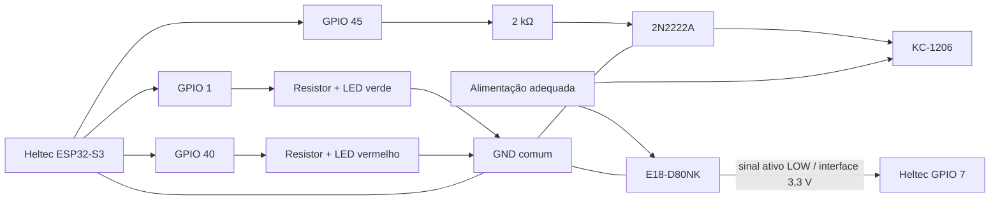

# Hardware e montagem física

Este documento descreve o hardware de uma estação FlowCount e os pontos elétricos que precisam ser respeitados na montagem. O firmware correspondente está documentado em [main/README.md](../main/README.md).

## Visão geral da estação

Uma estação de contagem possui três blocos principais:

```text
Sensor fotoelétrico
        |
        v
Interface elétrica -> Heltec WiFi LoRa 32 V3 / ESP32-S3
                            |
                            +-> Wi-Fi para a Raspberry Pi
                            |
                            +-> GPIO45 -> transistor -> buzzer
                            |
                            +-> GPIO1 -> resistor -> LED verde -> GND
                            |
                            +-> GPIO40 -> resistor -> LED vermelho -> GND
```

## Lista de materiais por estação

| Componente | Quantidade | Função |
|---|---:|---|
| Heltec WiFi LoRa 32 V3 | 1 | microcontrolador e Wi-Fi |
| Sensor fotoelétrico E18-D80NK | 1 | detecção de passagem |
| Buzzer KC-1206 | 1 | sinalização sonora |
| Transistor NPN 2N2222A-1726 | 1 | chaveamento do buzzer |
| Resistor 100 kΩ | 3 | componentes previstos na interface do sensor do protótipo |
| Resistor 2 kΩ | 1 | resistor de base do transistor |
| Resistor 220 Ω | 2 | um por LED; valor de referência do protótipo |
| LED verde | 1 | pulso em cada passagem válida |
| LED vermelho | 1 | indicação contínua de Wi-Fi ou MQTT desconectado |
| Protoboard/placa | 1 | montagem do protótipo |
| Jumpers | conforme necessário | conexões |
| Cabo USB de dados | 1 | alimentação, flash e monitor serial |
| Fonte adequada | 1 | alimentação segura da estação |

Além da estação, o sistema completo utiliza uma Raspberry Pi 5 como servidor. Consulte [raspberry.md](raspberry.md).

## Pinagem utilizada pelo firmware

| Função | GPIO | Observação |
|---|---:|---|
| entrada do sensor | 7 | ativo em LOW; pull interno desabilitado |
| comando do buzzer | 45 por padrão | configurável em `menuconfig` |
| LED verde | 1 por padrão | ativo em HIGH; pulso de 100 ms por passagem válida |
| LED vermelho | 40 por padrão | ativo em HIGH enquanto Wi-Fi ou MQTT estiver desconectado |

A placa física é a Heltec WiFi LoRa 32 V3. Sempre confirme a serigrafia e o pinout da revisão exata da placa antes de conectar jumpers. Um número GPIO não deve ser confundido com a posição física do header.

## Sensor E18-D80NK

O firmware espera um sinal lógico com esta semântica:

```text
LOW  -> peça detectada
HIGH -> caminho livre
```

O código desabilita os pull-ups e pull-downs internos do ESP32. Portanto, a montagem deve garantir externamente um nível definido e compatível com 3,3 V no GPIO 7.

Módulos E18-D80NK são encontrados em diferentes montagens e faixas de alimentação. Antes de energizar:

1. confirme a tensão nominal do módulo que você possui;
2. confirme a função de cada fio pelo datasheet/etiqueta do módulo;
3. confirme se a saída é coletor aberto/NPN na sua unidade;
4. garanta que o GPIO do ESP32 nunca receba tensão acima da especificação de 3,3 V;
5. compartilhe GND entre sensor e ESP32 quando a interface exigir referência comum.

### Sobre os três resistores de 100 kΩ

O protótipo informado para o projeto possui três resistores de 100 kΩ associados à interface do sensor. O `diagram.json` atual também os representa, porém a simulação usa uma chave deslizante no lugar do E18-D80NK e não constitui um esquema elétrico definitivo do módulo real.

Por isso, os valores fazem parte da lista de materiais do protótipo, mas a ligação final desses três resistores deve ser conferida com o circuito físico validado antes de fabricar PCB ou replicar em escala. O requisito funcional que não pode ser violado é: **GPIO 7 deve receber HIGH compatível com 3,3 V quando livre e LOW quando a peça estiver presente**.

## Estágio do buzzer

O GPIO 45 deve controlar o transistor por um resistor de 2 kΩ. Uma topologia de referência para o protótipo é:

```text
GPIO45 ---- 2 kΩ ---- Base do 2N2222A
                         |
                      Transistor
                         |
GND ---------------- Emissor
                         |
                      Coletor -------- negativo do buzzer
                                       positivo do buzzer -> alimentação adequada
```

O GPIO fornece apenas o sinal de controle. A corrente da carga não deve passar diretamente pelo pino do ESP32.

Para uma carga magnética, use proteção contra transientes conforme a especificação do buzzer e do transistor. Um diodo de flyback sobre a carga é uma prática recomendada quando aplicável.

A pinagem física B/C/E do 2N2222 varia entre encapsulamentos/fabricantes. Não determine base, coletor e emissor apenas pela posição visual do componente; confira o datasheet da peça instalada.

## LEDs independentes

Os LEDs usam dois GPIOs próprios, separados do transistor e do GPIO45 do buzzer. Faça a ligação com a alimentação desligada:

```text
GPIO1  ---- resistor ---- ânodo (+) LED verde    cátodo (-) ---- GND
GPIO40 ---- resistor ---- ânodo (+) LED vermelho cátodo (-) ---- GND
```

Use **um resistor individual para cada LED**. O valor de 220 Ω já usado no protótipo é a referência da lista de materiais; confirme a corrente pelo LED instalado: `I = (3,3 V - Vf) / R`, em que `Vf` é sua queda de tensão direta. A ligação GPIO → resistor → ânodo, com cátodo ao GND, segue o [exemplo de LED externo da Arduino](https://docs.arduino.cc/built-in-examples/basics/Blink/); neste projeto a saída é de 3,3 V.

**Remova o LED e seu resistor da ligação antiga ao estágio do buzzer** antes de reconectá-los ao GPIO40. Adicione o LED verde com outro resistor no GPIO1. Assim, GPIO45 continua comandando somente o transistor do buzzer. Não una os GPIOs 1, 40 e 45.

O verde acende por 100 ms quando a passagem é confirmada após a liberação estável do sensor, inclusive offline. Uma nova passagem durante o pulso renova sua duração. O vermelho fica aceso desde a inicialização dos LEDs enquanto Wi-Fi **ou** MQTT estiver desconectado, apagando quando ambos conectam. Com `FLOWCOUNT_COMM_ENABLED=n`, permanece apagado. Os sons existentes do buzzer continuam iguais.

Os padrões podem ser alterados por `FLOWCOUNT_LED_GREEN_GPIO`, `FLOWCOUNT_LED_RED_GPIO` e `FLOWCOUNT_LED_PULSE_MS`. Os pinos escolhidos devem ser distintos e livres de outros usos no circuito.

### Particularidades da Heltec V3

O [datasheet oficial da Heltec V3.2, tabela 2.2-2](https://s.heltec.cn/download/WiFi_LoRa_32_V3/HTIT-WB32LA_V3.2.pdf) identifica GPIO1 e GPIO40 no header, mas também associa GPIO1 à leitura de tensão da bateria e GPIO40 à função JTAG `MTDO`. Confira a revisão instalada: usar GPIO1 como saída do LED impede a leitura da bateria pelo mesmo pino. GPIO40 não pode ser usado simultaneamente pelo LED e pela depuração JTAG externa nesses pinos. A [orientação oficial de GPIOs da Heltec](https://github.com/HelTecAutomation/HeltecWiKi/blob/main/docs/devices/open-source-hardware/esp32-series/lora-32/wifi-lora-32-v3/Pin-diagram-guidance.md) explica a reutilização dos pinos JTAG como GPIO.

## Alimentação e GND

Princípios obrigatórios:

- não aplicar 5 V diretamente a um GPIO do ESP32-S3;
- manter GND comum entre os circuitos que trocam sinal elétrico;
- alimentar buzzer e sensor conforme a especificação de cada unidade;
- não assumir que o pino `Vext/Ve` da Heltec equivale ao pino de 5 V;
- conferir a corrente disponível da alimentação USB antes de adicionar cargas;
- evitar que o circuito ligado ao GPIO45 force um nível inadequado durante reset, pois GPIO45 possui função de strapping no ESP32-S3.

## Diagrama funcional de conexões



Esse diagrama representa relações funcionais. Para montagem definitiva, valide a polaridade do buzzer, a pinagem do transistor e o circuito exato do sensor.

## Montagem recomendada

1. monte primeiro somente a Heltec e confirme que ela pode ser gravada e monitorada por USB;
2. com o sistema desligado, monte a interface do sensor;
3. antes de conectar ao GPIO 7, meça a saída do circuito e confirme que permanece dentro de 0–3,3 V;
4. conecte o sensor ao GPIO 7 e teste leituras com o firmware;
5. monte o transistor com resistor de 2 kΩ e buzzer;
6. remova a ligação antiga do LED ao buzzer e monte os LEDs independentes nos GPIOs 1 e 40, cada um com seu resistor;
7. confira continuidade de GND e trilhas da protoboard;
8. energize e valide primeiro sem esteira;
9. depois posicione o sensor na geometria real da passagem;
10. calibre distância e limiares observando peças reais.

## Checklist antes de ligar

- [ ] pinout da revisão da Heltec confirmado;
- [ ] GPIO 7 não recebe mais de 3,3 V;
- [ ] transistor B/C/E confirmado por datasheet;
- [ ] resistor de base de 2 kΩ instalado;
- [ ] cada LED possui seu resistor individual em série e cátodo no GND;
- [ ] LED verde no GPIO1 e vermelho no GPIO40, sem ligação ao estágio do buzzer;
- [ ] polaridade/alimentação do buzzer conferidas;
- [ ] GND comum presente;
- [ ] não existem curtos entre trilhas de alimentação;
- [ ] sensor e buzzer estão dentro de suas tensões especificadas;
- [ ] circuito externo não força GPIO45 durante boot.

## Validação do sensor

Abra o monitor serial:

```bash
idf.py -p /dev/ttyACM0 monitor
```

No boot, o firmware deve informar que o GPIO 7 é ativo em LOW e aguarda uma liberação estável.

Teste:

1. deixe o sensor livre por mais de 50 ms;
2. bloqueie-o de forma estável;
3. libere-o;
4. confirme apenas uma passagem válida;
5. repita rapidamente para identificar o limite da instalação;
6. mantenha o sensor bloqueado por mais de 5 s e confirme o aviso de possível bloqueio.

## Wokwi

A simulação disponível não substitui a validação elétrica do hardware. Ela utiliza:

- uma placa ESP32-S3 genérica como substituta da Heltec;
- uma chave deslizante como substituta do E18-D80NK;
- um buzzer genérico;
- analisador lógico para GPIO7 e GPIO45.

Se o `diagram.json` ainda mostrar o LED junto ao buzzer, essa ligação representa a montagem anterior. Para testar os LEDs independentes, a simulação deve reproduzir os GPIOs 1 e 40 e os dois resistores descritos acima.

Consulte [wokwi.md](wokwi.md).
