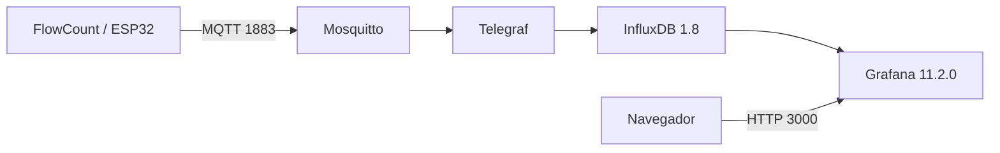

# Raspberry Pi e servidor FlowCount

O servidor do FlowCount é executado em uma Raspberry Pi 5 e utiliza um repositório separado para a infraestrutura de supervisão:

```text
https://github.com/ValdimiroAlves/Grafana_Dashboards
```

Esta documentação explica a integração necessária para o FlowCount. O repositório do servidor possui seu próprio guia detalhado de instalação.

## Papel da Raspberry Pi

A Raspberry não realiza a contagem física. Ela recebe e consolida os eventos produzidos pelos nós ESP32.



## Serviços atuais

O `docker-compose.yml` do servidor define:

| Serviço | Imagem/tag | Porta relevante |
|---|---|---:|
| Mosquitto | `eclipse-mosquitto:2` | 1883 |
| InfluxDB | `influxdb:1.8` | interna 8086 |
| Telegraf | `telegraf:1.30` | sem porta pública necessária |
| Grafana OSS | `grafana/grafana-oss:11.2.0` | 3000 |

Grafana está fixado em versão exata. As tags `2`, `1.8` e `1.30` fixam a série, mas não um patch imutável.

## Hardware recomendado do servidor

| Item | Quantidade | Observação |
|---|---:|---|
| Raspberry Pi 5 | 1 | servidor central |
| fonte USB-C 27 W adequada | 1 | evita under-voltage |
| cooler ativo | 1 | recomendado para operação contínua |
| microSD A2/V30 de 128 GB | 1 | referência do projeto |
| gabinete | 1 | proteção física |
| Ethernet ou Wi-Fi | 1 | Ethernet é preferível para servidor fixo |

Para operação contínua e maior durabilidade de armazenamento, SSD USB pode ser preferível ao microSD.

## 1. Preparar o sistema operacional

Grave **Raspberry Pi OS Lite 64-bit** com o Raspberry Pi Imager.

Durante a personalização, configure:

- hostname;
- usuário e senha;
- SSH;
- rede Wi-Fi, se necessário;
- país `BR`;
- fuso `America/Sao_Paulo`.

Depois do primeiro boot, conecte por SSH:

```bash
ssh <usuario>@<ip-da-raspberry>
```

Atualize:

```bash
sudo apt update
sudo apt full-upgrade -y
sudo apt install -y git curl mosquitto-clients
sudo reboot
```

Após reconectar, confira o relógio:

```bash
timedatectl
```

## 2. Usar endereço estável

O firmware precisa de uma URI MQTT estável. A solução recomendada é criar uma reserva DHCP no roteador para o MAC da Raspberry.

Consulte endereços:

```bash
ip a
```

Exemplo de IP reservado:

```text
192.168.1.50
```

A URI no ESP32 será:

```text
mqtt://192.168.1.50:1883
```

## 3. Instalar Docker

```bash
curl -fsSL https://get.docker.com | sudo sh
sudo usermod -aG docker $USER
```

Saia e entre novamente na sessão, depois valide:

```bash
docker run --rm hello-world
docker compose version
```

## 4. Clonar o servidor

```bash
cd ~
git clone https://github.com/ValdimiroAlves/Grafana_Dashboards.git
cd Grafana_Dashboards
```

Crie o ambiente:

```bash
cp .env.example .env
```

Edite o `.env` e defina uma senha forte para o Grafana.

Garanta leitura das configurações pelos containers:

```bash
chmod -R a+rX grafana telegraf mosquitto
```

## 5. Subir os serviços

```bash
docker compose up -d
docker compose ps
```

Os quatro serviços devem aparecer em execução.

Logs úteis:

```bash
docker compose logs --tail=100 mosquitto
docker compose logs --tail=100 telegraf
docker compose logs --tail=100 influxdb
docker compose logs --tail=100 grafana
```

## 6. Acessar o Grafana

Na mesma rede:

```text
http://<ip-da-raspberry>:3000
```

Usuário padrão configurado no compose:

```text
admin
```

A senha deve vir do `.env`.

O servidor provisiona o data source e o dashboard automaticamente.

## 7. Fluxo de ingestão esperado

O Telegraf assina:

```text
fabrica/+/bancada/+/evento
```

O firmware FlowCount publica, por exemplo:

```text
fabrica/setorA/bancada/B01/evento
```

Payload atual:

```json
{
  "bancada": "B01",
  "evt_id": "00112233445566778899aabbccddeeff-482",
  "ts": "2026-09-11T21:00:00.123000Z",
  "delta": 1
}
```

No Telegraf:

- `bancada` vira uma tag;
- a measurement é `producao`;
- `ts` define o timestamp do ponto;
- `delta` é gravado como field numérico;
- o banco utilizado é `saap`.

## 8. Validar o broker antes do ESP32

Na Raspberry:

```bash
mosquitto_sub -h localhost -t 'fabrica/#' -v
```

Em outro terminal, publique um evento simples:

```bash
mosquitto_pub -h localhost -u flowcount -P "SENHA" \
  -t 'fabrica/setorA/bancada/B01/evento' \
  -m '{"bancada":"B01","evt_id":"00112233445566778899aabbccddeeff-482","ts":"2026-09-11T21:00:00.123000Z","delta":1}'
```

A mensagem deve aparecer no `mosquitto_sub`.

## 9. Confirmar ingestão no InfluxDB

Depois de publicar:

```bash
docker compose exec -T influxdb influx -database saap \
  -execute 'SHOW MEASUREMENTS'
```

Depois:

```bash
docker compose exec -T influxdb influx -database saap \
  -execute 'SELECT * FROM "producao" ORDER BY time DESC LIMIT 5'
```

Para somar eventos recentes por bancada:

```bash
docker compose exec -T influxdb influx -database saap \
  -execute 'SELECT sum("delta") FROM "producao" WHERE time > now() - 12h GROUP BY "bancada"'
```

## Compatibilidade do dashboard com o payload atual

O firmware desta revisão envia somente:

```json
{
  "bancada": "B01",
  "ts": "...",
  "delta": 1
}
```

O dashboard do repositório de servidor possui um painel histórico chamado `Total do turno por bancada` que consulta `last("total_turno")`. Como o firmware atual não publica `total_turno`, esse painel específico pode permanecer vazio mesmo quando os demais painéis baseados em `sum("delta")` funcionam normalmente.

O checkout analisado do FlowCount contém `integrations/raspberry/grafana-periodo.patch`, que altera esse painel para:

```text
Total no período por bancada
SELECT sum("delta") FROM "producao" WHERE $timeFilter GROUP BY "bancada"
```

Para aplicar na Raspberry, a partir do repositório `Grafana_Dashboards`:

```bash
git apply --check /caminho/grafana-periodo.patch
git apply /caminho/grafana-periodo.patch
docker compose restart grafana
```

Essa alteração evita inventar um `total_turno` no nó: o total passa a ser calculado pelo intervalo selecionado no Grafana.

## 10. Apontar o FlowCount para a Raspberry

No repositório do firmware:

```bash
idf.py menuconfig
```

Configure:

```text
FlowCount - comunicacao ESP32
  Wi-Fi SSID
  Wi-Fi senha
  MQTT broker URI = mqtt://<IP-DA-RASPBERRY>:1883
```

Configure também a identificação da bancada, por exemplo `B01`.

Depois:

```bash
idf.py build
idf.py -p /dev/ttyACM0 flash monitor
```

No serial, procure:

```text
Wi-Fi conectado
Cliente MQTT iniciado
MQTT conectado
Evento entregue ao outbox MQTT
```

## 11. Diagnóstico ponta a ponta

Quando o painel estiver vazio, não comece pelo Grafana. Verifique em ordem:

### Etapa A: o ESP32 está publicando?

No serial, confirme o log de entrega ao outbox.

### Etapa B: o broker recebe?

```bash
mosquitto_sub -h localhost -t 'fabrica/#' -v
```

### Etapa C: o Telegraf aceita o JSON?

```bash
docker compose logs --tail=100 telegraf
```

Erros sobre `JSON time key could not be found` normalmente indicam ausência ou incompatibilidade da chave `ts`.

### Etapa D: o InfluxDB contém o ponto?

Use a consulta `SELECT * FROM "producao" ...`.

### Etapa E: o Grafana consulta a fonte correta?

Confira o data source `InfluxDB-SAAP`, o banco `saap` e o intervalo de tempo selecionado no dashboard.

## 12. Persistência após reboot

O Docker é habilitado no boot pelo instalador, e os serviços do compose usam:

```text
restart: unless-stopped
```

Teste:

```bash
sudo reboot
```

Após a Raspberry voltar:

```bash
cd ~/Grafana_Dashboards
docker compose ps
```

## 13. Acesso remoto

O projeto de servidor possui instruções para Tailscale. A ideia recomendada é expor remotamente somente o Grafana, mantendo MQTT e InfluxDB restritos à rede adequada.

Evite abrir a porta MQTT diretamente para a internet.

## 14. Segurança do estado atual

A configuração atual do servidor foi preparada para desenvolvimento/protótipo e inclui escolhas que devem ser endurecidas em produção:

- Mosquitto está com `allow_anonymous true`;
- InfluxDB está com autenticação HTTP desabilitada;
- MQTT utiliza conexão sem TLS no fluxo atual;
- credenciais Wi-Fi/MQTT no firmware precisam ser protegidas;
- senha padrão do Grafana não deve ser usada.

Antes de implantação real, adicione autenticação, restrinja rede e avalie TLS.

## Comandos de manutenção

Dentro do repositório do servidor:

| Tarefa | Comando |
|---|---|
| status | `docker compose ps` |
| logs | `docker compose logs -f` |
| parar | `docker compose down` |
| subir | `docker compose up -d` |
| reiniciar Telegraf | `docker compose restart telegraf` |
| reiniciar Grafana | `docker compose restart grafana` |
| atualizar imagens | `docker compose pull && docker compose up -d` |

`docker compose down` sem `-v` mantém os volumes de dados.

## Referência externa

Para a instalação detalhada do servidor, incluindo Tailscale, backups e troubleshooting adicional, consulte `INSTALL-raspberrypi.md` no repositório `ValdimiroAlves/Grafana_Dashboards`.
