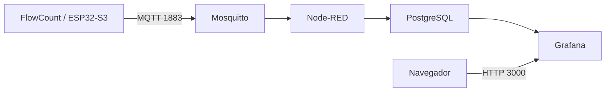

# Raspberry Pi e servidor FlowCount

O servidor recebe eventos das estações por MQTT, processa-os no Node-RED, armazena-os no PostgreSQL e disponibiliza os painéis no Grafana.

Para instalar do zero, siga o [guia de instalação](instalacao.md#1-preparar-o-servidor), que inclui sistema operacional, Docker, autenticação, credenciais, publicação de teste e validação do painel. Os comandos deste documento são executados **na Raspberry**, em `~/Grafana_Dashboards`.

## Configuração de referência

Conferida no [repositório do servidor, revisão `6359597`](https://github.com/ValdimiroAlves/Grafana_Dashboards/tree/6359597918faf1b41a83b39492e5ba1cee65c281), em 16/09/2026.



| Serviço Compose | Imagem / componente | Acesso |
|---|---|---|
| `mosquitto` | `eclipse-mosquitto:2` | TCP 1883; usuário e senha obrigatórios |
| `postgres` | `postgres:16.15-alpine` | `postgres:5432` na rede Docker; sem porta publicada no host |
| `node-red` | Build local sobre `nodered/node-red:5.0.7` | Editor em `http://<ip-da-raspberry>:1880` |
| `grafana` | `grafana/grafana-oss:11.2.0` | Painel em `http://<ip-da-raspberry>:3000` |

A imagem Node-RED inclui `node-red-contrib-postgresql@0.16.2`. A tag do Mosquitto fixa somente a série; as imagens não estão fixadas por digest. O editor Node-RED não possui autenticação nessa configuração e deve permanecer na rede local de teste.

## Credenciais e persistência

- `mosquitto/config/passwd`: criado antes do primeiro boot; contém o usuário MQTT `flowcount`.
- `.env`: define `GRAFANA_PASSWORD` e `POSTGRES_PASSWORD`.
- Node-RED: configure as duas conexões pelo editor e execute **Deploy**. A senha PostgreSQL não é importada automaticamente do `.env`.
- `postgres_data`: histórico de produção e credenciais iniciais do banco.
- `node_red_data`: fluxos, configurações, módulos e credenciais salvas pelo Node-RED.
- `grafana_data`: estado persistente do Grafana.

Os scripts de `postgres/init/` rodam automaticamente apenas quando o volume do banco está vazio. Da mesma forma, reconstruir a imagem Node-RED não substitui os fluxos de um volume existente. Alterar a senha no `.env` também não altera automaticamente a senha de um usuário já criado no banco.

Para atualizar uma instalação existente, faça backup do banco e exporte os fluxos antes de seguir as instruções de migração da revisão de destino. Não use `docker compose down -v` como procedimento de atualização: ele remove os volumes e seus dados.

## Contrato dos eventos

O Node-RED assina `fabrica/+/bancada/+/evento`. A bancada B01 publica em `fabrica/setorA/bancada/B01/evento`, com este formato:

```json
{
  "bancada": "B01",
  "evt_id": "00112233445566778899aabbccddeeff-482",
  "ts": "2026-09-16T15:00:00.123000Z",
  "delta": 1
}
```

O horário é apenas ilustrativo; nos ensaios, gere um timestamp atual conforme o [teste de ingestão](instalacao.md#17-validar-mqtt-gravação-e-deduplicação).

| Campo MQTT | Coluna em `producao` | Significado |
|---|---|---|
| `bancada` | `bancada` | Identificação da estação |
| `evt_id` | `evt_id` | Identidade estável do evento para deduplicação |
| `ts` | `ocorrido_em` | Horário da passagem em UTC |
| `delta` | `delta` | Incremento de uma peça |
| — | `recebido_em` | Horário da inserção no servidor |

O firmware desta revisão **já envia `evt_id`**, embora existam comentários antigos no servidor dizendo o contrário. O fluxo executa `INSERT ... ON CONFLICT DO NOTHING`; o índice por `(bancada, evt_id)` evita inserir novamente o mesmo evento. O firmware não publica `total_turno` nem `total_hora`: os painéis atuais calculam agregados no banco.

A validação Node-RED rejeita JSON inválido, bancada vazia e timestamp inválido. Um `delta` diferente de 1 é normalizado para 1 com aviso; não use esse campo como teste de rejeição.

## Consultar o histórico

```bash
docker compose exec -T postgres psql -U saap -d saap \
  -c "SELECT bancada, evt_id, ocorrido_em, recebido_em, delta FROM producao ORDER BY id DESC LIMIT 10;"
docker compose exec -T postgres psql -U saap -d saap \
  -c "SELECT bancada, sum(delta) AS total FROM producao WHERE ocorrido_em > now() - interval '15 minutes' GROUP BY bancada ORDER BY bancada;"
```

O Grafana utiliza o datasource **PostgreSQL-SAAP**, UID `saap-postgres`. Os dashboards ficam na pasta **SAAP**; o painel principal tem UID `saap-main`. Confira sempre o intervalo de tempo selecionado.

## Diagnóstico por camada

| Sintoma | Verificação | Resultado esperado / correção |
|---|---|---|
| Mosquitto reinicia | `docker compose logs --tail=100 mosquitto` | Arquivo `passwd` presente e legível; listener em 1883 |
| ESP32 não conecta | Logs seriais, URI e credenciais MQTT | IP da Raspberry, usuário `flowcount` e senha do broker; Wi-Fi 2,4 GHz |
| Conecta mas não envia | Log `CLOCK_SYNCED` no ESP32 | Corrigir acesso ao SNTP/DNS se continuar `CLOCK_UNSYNCED` |
| MQTT chega, banco não recebe | Debug do Node-RED e `docker compose logs --tail=100 node-red` | Entrada MQTT conectada, JSON válido, conexão PostgreSQL configurada e Deploy concluído |
| Erro PostgreSQL | `docker compose logs --tail=100 postgres` e `pg_isready` | Banco pronto, schema inicializado, mesma senha no banco e no Node-RED |
| Banco recebe, painel vazio | **Save & test** em PostgreSQL-SAAP; intervalo e filtros do dashboard | Conexão aprovada e evento dentro do intervalo |
| Simulador parece parar de gravar | Verificar repetição de `(bancada, evt_id)` | Usar nova bancada de teste ao reiniciar o simulador |

No monitor serial, `Evento entregue ao outbox MQTT` confirma a entrega ao cliente MQTT local; não comprova gravação no banco. Use a consulta SQL para concluir a verificação.

## Manutenção e reinicialização

```bash
docker compose ps
docker compose logs --tail=100 mosquitto node-red postgres grafana
docker compose restart node-red
```

Para validar persistência, registre o total de uma bancada de teste, reinicie a Raspberry e repita a consulta após os serviços voltarem. O total anterior deve permanecer. Publique outro evento com novo `evt_id` e confirme que o total aumenta em um.

Os serviços usam `restart: unless-stopped`. Se foram parados manualmente, execute `docker compose up -d` para retomá-los. O comando `docker compose down` sem `-v` preserva os volumes.

Consulte também o [guia do servidor](https://github.com/ValdimiroAlves/Grafana_Dashboards/blob/6359597918faf1b41a83b39492e5ba1cee65c281/INSTALL-raspberrypi.md) para operações adicionais e o [roteiro de ensaios](../tests/README.md#ensaios-de-bancada-e-integração).
