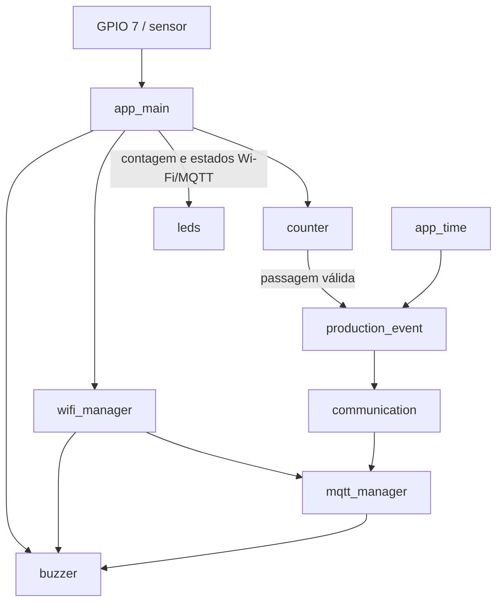
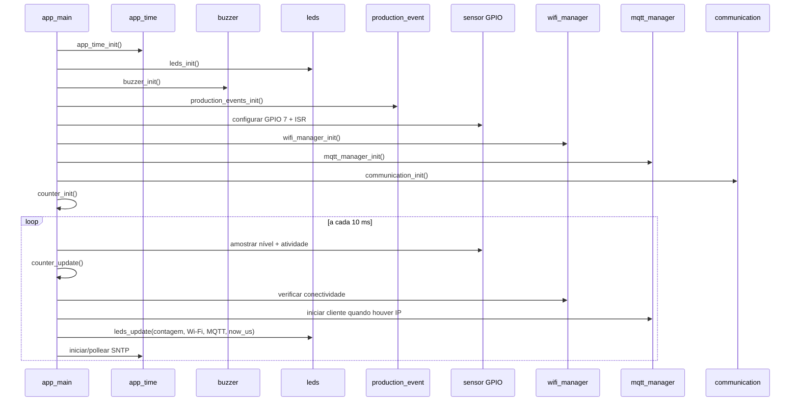
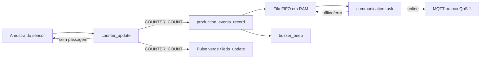

# Firmware do FlowCount

Esta documentação descreve o firmware executado no nó de bancada do FlowCount, baseado em ESP32-S3. O objetivo deste arquivo é explicar como os módulos internos se organizam e se integram. A visão geral do produto, a lista completa de materiais e a instalação do sistema inteiro permanecem no [README principal](../README.md).

## Sumário

- [Responsabilidade do firmware](#responsabilidade-do-firmware)
- [Plataforma e versão](#plataforma-e-versão)
- [Organização interna](#organização-interna)
- [Sequência de inicialização](#sequência-de-inicialização)
- [Fluxo durante a execução](#fluxo-durante-a-execução)
- [Concorrência e responsabilidades](#concorrência-e-responsabilidades)
- [Configurações do firmware](#configurações-do-firmware)
- [Compilar, gravar e monitorar](#compilar-gravar-e-monitorar)
- [Comportamento diante de falhas](#comportamento-diante-de-falhas)
- [Documentação dos módulos](#documentação-dos-módulos)

## Responsabilidade do firmware

O firmware é a camada de edge computing do FlowCount. Ele é responsável por:

1. ler o sinal do sensor fotoelétrico;
2. validar uma passagem de peça sem contar ruídos ou oscilações curtas;
3. registrar cada passagem válida como um evento de produção;
4. associar horário UTC ao evento quando o relógio está sincronizado;
5. manter temporariamente os eventos em uma fila de RAM;
6. conectar-se à rede Wi-Fi e ao broker MQTT;
7. encaminhar os eventos ao servidor;
8. emitir sinalização sonora para contagens e quedas de conectividade;
9. pulsar o LED verde em cada contagem e manter o vermelho aceso enquanto Wi-Fi ou MQTT estiver desconectado.

A aplicação foi organizada para que falhas de rede não interrompam a leitura do sensor. O caminho crítico da contagem continua executando mesmo quando Wi-Fi, MQTT ou SNTP estão indisponíveis.

## Plataforma e versão

| Item | Valor utilizado |
|---|---|
| Placa do projeto | Heltec WiFi LoRa 32 V3 |
| Microcontrolador | ESP32-S3 |
| Target ESP-IDF | `esp32s3` |
| ESP-IDF validado | `5.5.5` |
| Linguagem | C |
| Sistema de build | CMake + ESP-IDF |
| Sensor no firmware | GPIO 7, ativo em nível baixo |
| Buzzer no firmware | GPIO configurável, padrão GPIO 45 |
| LED verde | GPIO configurável, padrão GPIO 1; pulso de 100 ms |
| LED vermelho | GPIO configurável, padrão GPIO 40; aceso sem Wi-Fi ou MQTT |
| Período de amostragem do sensor | 10 ms |

O rádio LoRa presente na placa Heltec não participa do fluxo atual. A comunicação implementada nesta versão utiliza Wi-Fi e MQTT.

## Organização interna

O componente principal é dividido por responsabilidade:

```text
main/
├── CMakeLists.txt
├── Kconfig.projbuild
├── include/
│   ├── communication/
│   │   ├── communication.h
│   │   ├── mqtt_manager.h
│   │   ├── mqtt_protocol.h
│   │   └── wifi_manager.h
│   ├── counting/
│   │   ├── counter.h
│   │   └── production_event.h
│   ├── indicators/
│   │   ├── buzzer.h
│   │   └── leds.h
│   └── time/
│       └── app_time.h
└── src/
    ├── main.c
    ├── communication/
    │   ├── communication.c
    │   ├── mqtt_manager.c
    │   ├── mqtt_protocol.c
    │   └── wifi_manager.c
    ├── counting/
    │   ├── counter.c
    │   └── production_event.c
    ├── indicators/
    │   ├── buzzer.c
    │   └── leds.c
    └── time/
        └── app_time.c
```

A integração entre os módulos pode ser resumida assim:



## Sequência de inicialização

A função `app_main()` realiza a inicialização em uma ordem deliberada:

1. **Relógio:** `app_time_init()` prepara o estado temporal, mas não espera conexão nem sincronização.
2. **Indicadores:** `leds_init()` configura os GPIOs dos LEDs, com verde apagado e vermelho aceso até conectar Wi-Fi e MQTT (apagado se a comunicação estiver desabilitada); `buzzer_init()` configura LEDC, PWM e o timer periódico usado pelo sequenciador de sons.
3. **Eventos de produção:** `production_events_init()` cria a sessão da execução e a fila em RAM.
4. **Sensor:** configura GPIO 7 como entrada com interrupção em qualquer borda.
5. **Wi-Fi:** `wifi_manager_init()` prepara a interface Station e inicia a tentativa de conexão.
6. **MQTT:** `mqtt_manager_init()` cria o cliente, mas o cliente só é iniciado quando o Wi-Fi já possui IP.
7. **Comunicação:** `communication_init()` cria a tarefa que consome a fila de entrega.
8. **Contador:** a máquina de estados é inicializada a partir do nível atual do sensor.
9. **Loop principal:** começa a amostragem periódica em intervalos de 10 ms.

Essa ordem evita que inicializações mais lentas de rede sejam interpretadas pela máquina de estados como uma lacuna de amostragem do sensor.



## Fluxo durante a execução

A ISR do sensor não realiza contagem. Ela apenas marca que ocorreu alguma borda desde a última amostragem. A tarefa principal lê essa informação junto com o nível atual do GPIO.

Quando a máquina de estados reconhece uma passagem válida:

1. `counter_update()` retorna `COUNTER_COUNT`;
2. `production_events_record()` cria e enfileira o evento;
3. `buzzer_beep()` agenda um beep curto e `leds_update()` inicia o pulso verde de 100 ms;
4. a tarefa de comunicação, em paralelo, tenta transferir os eventos pendentes para o outbox do ESP-MQTT;
5. o servidor recebe o JSON e segue com a ingestão no pipeline de supervisão.



A passagem é confirmada após a liberação estável do sensor. O pulso verde acontece mesmo offline e indica a contagem local, sem confirmar a entrega ao servidor. Uma nova passagem durante o pulso renova sua duração. Em cada iteração do loop principal, `leds_update()` também mantém o vermelho aceso se Wi-Fi **ou** MQTT estiver desconectado, inclusive na primeira conexão. Com `FLOWCOUNT_COMM_ENABLED=n`, o vermelho permanece apagado.

## Concorrência e responsabilidades

O firmware evita que múltiplos contextos disputem estruturas críticas sem necessidade.

| Recurso | Contexto principal responsável |
|---|---|
| Leitura/validação da passagem | `app_main` |
| Flag de atividade do sensor | ISR escreve; `app_main` lê e limpa |
| Criação de eventos | tarefa que executou `production_events_init()` |
| Retirada da fila de eventos | tarefa criada por `communication_init()` |
| Estado de Wi-Fi | callbacks do event loop + consultas por EventGroup |
| Estado MQTT | callback ESP-MQTT + consultas por EventGroup |
| Sequenciamento do buzzer | callback periódico de `esp_timer` |
| GPIOs e duração do pulso dos LEDs | exclusivamente `app_main`, por `leds_update()` a cada iteração; sem timer próprio ou espera |
| Referência UTC | callback SNTP; leitura protegida pelos consumidores |

A fila de produção possui um único produtor e um único consumidor de entrega. O módulo verifica a propriedade das tarefas para reduzir o risco de uso incorreto.

## Configurações do firmware

As opções específicas do FlowCount ficam em `main/Kconfig.projbuild` e podem ser alteradas com:

```bash
idf.py menuconfig
```

Principais opções:

| Configuração | Padrão | Finalidade |
|---|---:|---|
| `FLOWCOUNT_STATION_ID` | `1` | Identidade numérica da estação |
| `FLOWCOUNT_BANCADA` | `B01` | Nome textual enviado ao servidor |
| `FLOWCOUNT_EVENT_QUEUE_CAPACITY` | `72` | Quantidade de eventos mantidos na fila de RAM |
| `FLOWCOUNT_COMM_ENABLED` | `y` | Habilita Wi-Fi, MQTT e tarefa de entrega |
| `FLOWCOUNT_WIFI_SSID` | vazio | SSID da rede |
| `FLOWCOUNT_WIFI_PASSWORD` | vazio | Senha da rede |
| `FLOWCOUNT_MQTT_URI` | vazio | URI do broker, por exemplo `mqtt://192.168.1.50:1883` |
| `FLOWCOUNT_MQTT_USERNAME` | vazio | Usuário MQTT, quando utilizado |
| `FLOWCOUNT_MQTT_PASSWORD` | vazio | Senha MQTT, quando utilizada |
| `FLOWCOUNT_WIFI_RETRY_SECONDS` | `5` | Intervalo de nova tentativa do Wi-Fi |
| `FLOWCOUNT_NTP_SERVER` | `pool.ntp.org` | Servidor de horário |
| `FLOWCOUNT_CLOCK_MAX_AGE_SECONDS` | `86400` | Validade máxima da referência temporal |
| `FLOWCOUNT_BUZZER_GPIO` | `45` | GPIO de comando do transistor do buzzer |
| `FLOWCOUNT_BUZZER_FREQUENCY_HZ` | `2400` | Frequência do PWM do buzzer |
| `FLOWCOUNT_LED_GREEN_GPIO` | `1` | GPIO do LED verde de contagem |
| `FLOWCOUNT_LED_RED_GPIO` | `40` | GPIO do LED vermelho de conectividade |
| `FLOWCOUNT_LED_PULSE_MS` | `100` | Duração do pulso verde em milissegundos |

Existem ainda opções relacionadas a heartbeat, ACK de aplicação e prefixo de tópico. Parte dessa infraestrutura está definida no código, mas o caminho de entrega atualmente utilizado é o descrito em [communication](src/communication/README.md).

## Compilar, gravar e monitorar

Com o ESP-IDF 5.5.5 ativo:

```bash
idf.py set-target esp32s3
idf.py menuconfig
idf.py build
```

Conecte a Heltec por USB e identifique a porta, por exemplo:

```bash
ls /dev/ttyACM* /dev/ttyUSB* 2>/dev/null
```

Grave e abra o monitor serial:

```bash
idf.py -p /dev/ttyACM0 flash monitor
```

Para sair do monitor do ESP-IDF, use `Ctrl+]`.

Não versione `sdkconfig` contendo SSID, senha ou credenciais reais. O projeto já trata esse arquivo como configuração local.

## Comportamento diante de falhas

O projeto privilegia continuidade da coleta sempre que possível.

| Falha | Comportamento esperado |
|---|---|
| Sem Wi-Fi | contagem continua; eventos ficam na fila até o limite |
| MQTT desconectado | contagem continua; tarefa de comunicação não remove eventos válidos |
| Outbox MQTT sem espaço | evento permanece na fila para nova tentativa |
| SNTP ainda não sincronizou | contagem continua; evento é criado sem UTC válido |
| Evento sem UTC chega à cabeça da fila de comunicação | implementação atual descarta esse evento para não bloquear a FIFO |
| Fila de produção cheia | nova passagem é registrada nas estatísticas, mas o evento é perdido e um erro é logado |
| Lacuna grande de amostragem | ciclo em andamento é descartado e o contador entra em ressincronização |
| Buzzer falha | erro é logado; contagem não depende do som |

A fila atual é volátil. Reiniciar ou desligar o ESP32 perde os eventos que ainda estiverem apenas em RAM ou no outbox volátil do cliente MQTT.

## Documentação dos módulos

- [Contagem e geração de eventos](src/counting/README.md)
- [Comunicação Wi-Fi e MQTT](src/communication/README.md)
- [Sinalização](src/indicators/README.md)
- [Horário e sincronização](src/time/README.md)
- [Hardware e montagem](../docs/hardware.md)
- [Servidor na Raspberry Pi](../docs/raspberry.md)
- [Simulação Wokwi](../docs/wokwi.md)
- [Testes](../tests/README.md)
