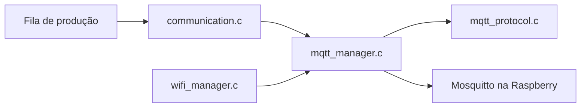

# Comunicação Wi-Fi e MQTT

Este diretório implementa a conectividade do nó FlowCount e a transferência dos eventos de produção para o servidor.

Voltar para a [documentação do firmware](../../README.md) ou para o [README principal](../../../README.md).

## Arquivos e responsabilidades

| Arquivo | Responsabilidade |
|---|---|
| `wifi_manager.c` | inicialização Wi-Fi, estado conectado e reconexão |
| `mqtt_manager.c` | ciclo de vida do cliente ESP-MQTT e publicação |
| `mqtt_protocol.c` | serialização JSON e utilitários de protocolo |
| `communication.c` | consumidor da fila de produção e política de entrega |



## Visão geral do fluxo

O firmware separa conectividade de envio:

1. `wifi_manager_init()` inicia a interface Station;
2. quando o ESP32 recebe IP, `wifi_manager_is_connected()` passa a retornar `true`;
3. `app_main` chama `mqtt_manager_start()` uma única vez;
4. o ESP-MQTT gerencia conexão e reconexão com o broker;
5. `communication_init()` mantém uma tarefa que consulta a fila de produção;
6. quando MQTT está conectado, o evento da cabeça é serializado e inserido no outbox do ESP-MQTT;
7. somente depois dessa aceitação o evento é removido da fila da aplicação.

## Wi-Fi

### Inicialização

`wifi_manager_init()` realiza:

- inicialização da NVS;
- `esp_netif_init()`;
- criação do event loop padrão;
- criação da interface Wi-Fi Station;
- inicialização do driver Wi-Fi;
- registro dos handlers de `WIFI_EVENT` e `IP_EVENT`;
- aplicação de SSID e senha;
- `esp_wifi_start()`.

O método não bloqueia esperando a conexão terminar.

### Estado conectado

A flag de conectividade é mantida em um EventGroup.

```text
IP_EVENT_STA_GOT_IP        -> conectado = true
WIFI_EVENT_STA_DISCONNECTED -> conectado = false
```

O firmware considera Wi-Fi operacional somente depois de obter IP.

### Reconexão

Ao perder a conexão, um `esp_timer` one-shot agenda nova chamada a `esp_wifi_connect()` após:

```text
CONFIG_FLOWCOUNT_WIFI_RETRY_SECONDS
```

O padrão é 5 segundos. Se já existe uma tentativa agendada, uma segunda não é criada.

### Autenticação

Quando a senha configurada está vazia, o código permite rede aberta. Caso contrário, a configuração mínima de autenticação é WPA2-PSK.

Credenciais não devem ser commitadas no repositório.

## MQTT

### Inicialização e início

`mqtt_manager_init()` valida a URI e cria o cliente ESP-MQTT. O cliente é configurado com reconexão automática habilitada.

`mqtt_manager_start()` só é chamado por `app_main` depois que o Wi-Fi possui IP.

Estados tratados pelo callback:

| Evento ESP-MQTT | Efeito |
|---|---|
| `MQTT_EVENT_CONNECTED` | marca MQTT conectado e informa o módulo de sinalização |
| `MQTT_EVENT_DISCONNECTED` | limpa o estado conectado e informa o módulo de sinalização |
| `MQTT_EVENT_ERROR` | registra aviso no log |

## Tópico publicado

A implementação atual publica em:

```text
fabrica/setorA/bancada/<BANCADA>/evento
```

Para a bancada padrão `B01`:

```text
fabrica/setorA/bancada/B01/evento
```

`<BANCADA>` vem de `CONFIG_FLOWCOUNT_BANCADA`.

Existe uma configuração `FLOWCOUNT_TOPIC_PREFIX` e funções auxiliares para validar prefixos, mas o caminho de publicação atual usa explicitamente `fabrica/setorA/bancada/...`. Portanto, alterar somente `FLOWCOUNT_TOPIC_PREFIX` não modifica o tópico enviado nesta versão.

## Payload

`mqtt_event_json()` gera o JSON utilizado pelo servidor:

```json
{
  "bancada": "B01",
  "evt_id": "00112233445566778899aabbccddeeff-482",
  "ts": "2026-09-11T21:00:00.123000Z",
  "delta": 1
}
```

Campos:

| Campo | Descrição |
|---|---|
| `bancada` | identificador textual da estação |
| `evt_id` | `<sessão do boot em hex>-<sequência>` — identifica o evento de forma estável entre reenvios (ver `production_event_t.session`/`.sequence`) |
| `ts` | horário UTC da ocorrência, em ISO 8601 com fração de segundo |
| `delta` | incremento de produção; atualmente sempre `1` |

O timestamp do payload vem do momento da passagem, não do momento da transmissão.

O servidor atual (repositório `Grafana_Dashboards`) recebe isso pelo Mosquitto, valida e grava no PostgreSQL via Node-RED. `evt_id` é a chave usada para deduplicar um evento reenviado (`INSERT ... ON CONFLICT DO NOTHING` sobre um índice único em `(bancada, evt_id)`) — sem ele, a deduplicação cai para uma chave mais frágil, só por `ts`. Ver `postgres/init/001_schema.sql` naquele repositório.

## QoS e outbox

A publicação utiliza `esp_mqtt_client_enqueue()` com:

```text
QoS = 1
retain = false
store = true
```

O evento só é removido da FIFO da aplicação se `esp_mqtt_client_enqueue()` aceitar a mensagem.

### O que isso garante

- se o nó estiver offline, o evento continua na FIFO da aplicação;
- se o outbox estiver sem espaço e a função falhar, o evento continua na FIFO;
- se a mensagem entrar no outbox, a responsabilidade de retransmissão até o PUBACK MQTT passa ao ESP-MQTT.

### O que isso não garante

A retirada da FIFO não significa que o dado já foi gravado no InfluxDB. Ela significa apenas que o SDK MQTT aceitou uma cópia da mensagem no outbox.

QoS 1 fornece entrega MQTT do tipo "pelo menos uma vez" e pode produzir duplicatas em alguns cenários. Além disso, a fila da aplicação e o outbox utilizados aqui são voláteis; um reboot pode perder dados ainda não persistidos.

## Tarefa de comunicação

`communication_init()` cria `flowcount_comm`, com stack de 4096 bytes e prioridade `tskIDLE_PRIORITY + 2`.

A tarefa reivindica a fila por `production_events_claim_delivery()` e executa repetidamente `communication_process_once()`.

### Algoritmo atual

```text
MQTT desconectado?
    sim -> não faz nada
    não -> existe evento na cabeça?
        não -> não faz nada
        sim -> evento possui UTC válido?
            não -> descarta o evento da FIFO
            sim -> tenta enfileirar no MQTT
                falhou -> preserva o evento
                sucesso -> remove o evento da FIFO
```

Quando a iteração termina sem erro, o loop espera aproximadamente 100 ms. Em erro, espera aproximadamente 1 segundo.

### Eventos sem UTC

A implementação atual descarta da FIFO eventos com:

```text
clock_synced = 0
ou
timestamp_ms <= 0
```

O objetivo é impedir que um evento sem horário válido bloqueie todos os eventos posteriores. Isso significa que uma peça contada antes da sincronização SNTP pode existir nas estatísticas locais, mas não chegar ao servidor.

Essa política deve ser considerada ao medir perdas durante boot ou indisponibilidade prolongada de NTP.

## Infraestrutura de ACK presente no código

`mqtt_protocol.c` também possui:

- `mqtt_ack_parse()`;
- `delivery_t`;
- `delivery_begin()`;
- `delivery_due()`;
- `delivery_attempt()`;
- `delivery_ack_matches()`.

Essas funções implementam partes de um protocolo de ACK de aplicação baseado em `station + session + sequence`. Elas possuem testes unitários, porém **não estão conectadas ao fluxo atual de `communication.c`/`mqtt_manager.c`**.

A entrega em produção nesta revisão termina, do ponto de vista da fila da aplicação, quando o payload é aceito pelo outbox ESP-MQTT. Não documente ACK de aplicação como garantia ativa até que esse caminho seja efetivamente integrado.

## Configurações relacionadas

| Opção | Padrão | Uso atual |
|---|---:|---|
| `FLOWCOUNT_COMM_ENABLED` | `y` | habilita toda a camada de rede |
| `FLOWCOUNT_WIFI_SSID` | vazio | SSID |
| `FLOWCOUNT_WIFI_PASSWORD` | vazio | senha Wi-Fi |
| `FLOWCOUNT_MQTT_URI` | vazio | URI, por exemplo `mqtt://192.168.1.50:1883` |
| `FLOWCOUNT_MQTT_USERNAME` | vazio | usuário MQTT opcional |
| `FLOWCOUNT_MQTT_PASSWORD` | vazio | senha MQTT opcional |
| `FLOWCOUNT_WIFI_RETRY_SECONDS` | `5` | retry do Wi-Fi |
| `FLOWCOUNT_TOPIC_PREFIX` | `flowcount` | definido e validável, mas não aplicado ao tópico atual |
| `FLOWCOUNT_HEARTBEAT_SECONDS` | `30` | definido no Kconfig, sem heartbeat ativo neste caminho atual |
| `FLOWCOUNT_ACK_TIMEOUT_SECONDS` | `30` | usado pela infraestrutura de protocolo testada, não pelo consumidor atual |
| `FLOWCOUNT_BANCADA` | `B01` | identificação enviada no tópico e JSON |

## Teste manual do broker

Na Raspberry Pi, para observar mensagens chegando:

```bash
mosquitto_sub -h localhost -u flowcount -P "SENHA" -t 'fabrica/#' -v
```

(o broker exige usuário/senha — ver a seção de autenticação MQTT no README do
repositório `Grafana_Dashboards`.) Em outra máquina da mesma rede, substitua
`localhost` pelo IP da Raspberry.

Uma mensagem válida deve se parecer com:

```text
fabrica/setorA/bancada/B01/evento {"bancada":"B01","evt_id":"00112233445566778899aabbccddeeff-482","ts":"2026-09-11T21:00:00.123000Z","delta":1}
```

## Diagnóstico rápido

### ESP32 conecta ao Wi-Fi, mas não ao MQTT

Verifique:

1. `FLOWCOUNT_MQTT_URI` contém `mqtt://` e a porta correta;
2. o IP é alcançável a partir da rede do ESP32;
3. Mosquitto está executando na Raspberry;
4. a porta 1883 não está bloqueada ou isolada pelo roteador;
5. o firmware foi reiniciado depois de alterar rede/configuração.

Na Raspberry:

```bash
docker compose ps
docker compose logs --tail=100 mosquitto
ss -lnt | grep 1883
```

### MQTT aparece conectado, mas nada chega ao Grafana

Separe o problema por etapas:

1. confirme a mensagem no Mosquitto com `mosquitto_sub`;
2. confira logs do Telegraf;
3. consulte diretamente o InfluxDB;
4. somente depois investigue o dashboard Grafana.

O Grafana não recebe MQTT diretamente.

### Eventos deixam de chegar após queda/reconexão

Confirme no serial:

- `Wi-Fi conectado`;
- `Cliente MQTT iniciado`;
- `MQTT conectado`;
- `Evento entregue ao outbox MQTT`.

A tarefa de comunicação continua percorrendo o backlog após a reconexão, sem exigir uma nova contagem para ser acordada.

## Testes relacionados

- `tests/test_communication.c`;
- `tests/test_mqtt_protocol.c`;
- `tests/test_network_alerts.c`.

Consulte [tests/README.md](../../../tests/README.md).
