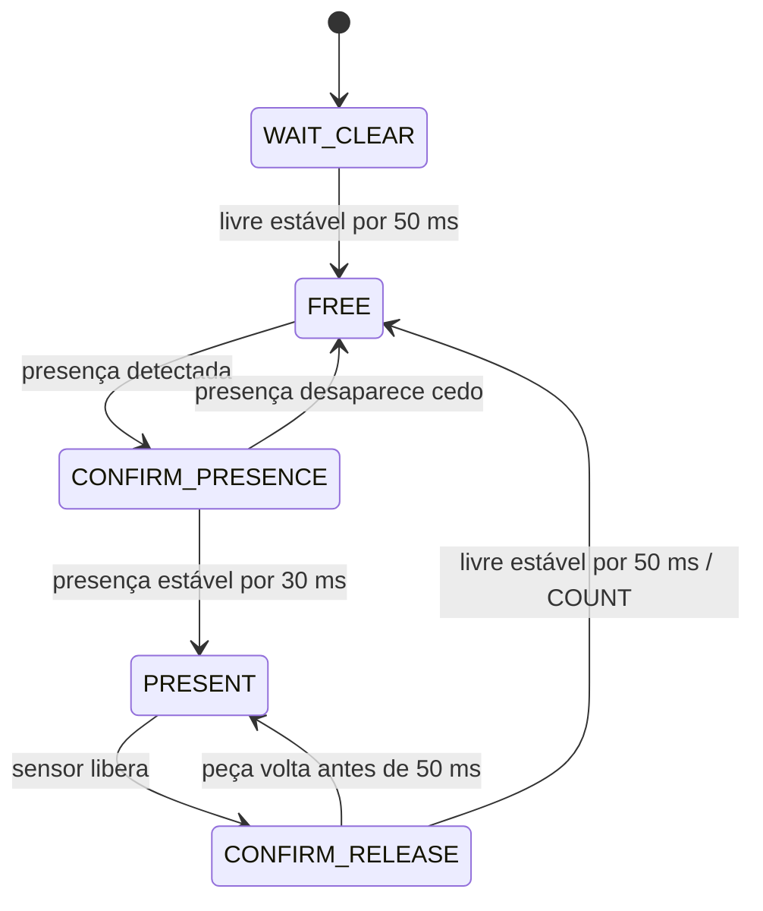
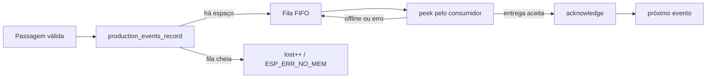

# Contagem e geração de eventos

Este módulo transforma o sinal bruto do sensor em eventos de produção confiáveis. Ele contém duas responsabilidades relacionadas, porém separadas:

- `counter.c`: valida a passagem física usando uma máquina de estados;
- `production_event.c`: cria a identidade do evento, associa o horário e mantém a fila FIFO em RAM.

Voltar para a [documentação do firmware](../../README.md) ou para o [README principal](../../../README.md).

## Arquivos

```text
main/
├── include/counting/
│   ├── counter.h
│   └── production_event.h
└── src/counting/
    ├── counter.c
    └── production_event.c
```

## Entrada do sensor

A integração realizada em `main.c` considera:

```text
GPIO 7 = 0  -> peça presente
GPIO 7 = 1  -> sensor livre
```

O sinal é, portanto, **ativo em LOW**.

O GPIO é configurado com interrupção em qualquer borda. A interrupção não conta peças e não realiza alocação, logs ou acesso à fila. Ela apenas informa que ocorreu atividade desde a amostra anterior.

A tarefa principal amostra o sensor aproximadamente a cada 10 ms e entrega ao contador:

- nível atual (`present`);
- indicação de que houve qualquer borda (`activity`);
- tempo monotônico atual em microssegundos.

Isso permite que uma oscilação que comece e termine entre duas amostras ainda invalide o período de estabilidade.

## Máquina de estados

Os estados definidos em `counter_state_t` são:

| Estado | Significado |
|---|---|
| `COUNTER_WAIT_CLEAR` | inicialização ou ressincronização; aguarda o sensor ficar livre antes de armar |
| `COUNTER_FREE` | estação pronta para observar uma nova peça |
| `COUNTER_CONFIRM_PRESENCE` | presença detectada, aguardando estabilidade mínima |
| `COUNTER_PRESENT` | peça confirmada em frente ao sensor |
| `COUNTER_CONFIRM_RELEASE` | saída detectada, aguardando liberação estável |



### Tempos atuais

Os valores ficam em `counter.h`:

| Constante | Valor | Uso |
|---|---:|---|
| `COUNTER_PRESENCE_US` | 30.000 us | presença mínima para confirmar uma peça |
| `COUNTER_RELEASE_US` | 50.000 us | liberação mínima para confirmar a saída |
| `COUNTER_BLOCKED_US` | 5.000.000 us | tempo para sinalizar possível bloqueio do sensor |
| `COUNTER_MAX_SAMPLE_GAP_US` | 100.000 us | maior lacuna de observação aceita |

Esses valores são parâmetros de bancada e devem ser recalibrados caso a geometria, a velocidade da esteira ou o comportamento elétrico do sensor mudem.

## Quando uma peça é contada

Uma contagem só ocorre depois deste ciclo completo:

```text
sensor livre
    -> presença detectada
    -> presença permanece estável por pelo menos 30 ms
    -> peça permanece presente
    -> sensor volta a ficar livre
    -> liberação permanece estável por pelo menos 50 ms
    -> COUNTER_COUNT
```

Uma peça que já está em frente ao sensor durante o boot não é contada automaticamente. O contador começa em `COUNTER_WAIT_CLEAR` e exige uma liberação estável antes de armar.

## Resultados retornados pelo contador

`counter_update()` devolve uma máscara de bits. Mais de um indicador pode aparecer na mesma chamada.

| Flag | Significado |
|---|---|
| `COUNTER_COUNT` | passagem válida concluída |
| `COUNTER_BLOCKED` | presença contínua ultrapassou 5 s |
| `COUNTER_CLEARED` | condição de bloqueio foi encerrada |
| `COUNTER_READY` | sensor ficou livre e a coleta foi armada |
| `COUNTER_RESYNC` | houve uma lacuna temporal incompatível com observação confiável |

### Sensor bloqueado

Se a peça permanecer presente por pelo menos 5 segundos, `COUNTER_BLOCKED` é gerado uma única vez para aquele episódio. O contador não cria contagens repetidas enquanto a peça está parada.

Quando o sensor volta a ficar livre de forma válida, o contador pode retornar `COUNTER_CLEARED`.

### Lacuna de amostragem

Se o tempo retroceder ou a diferença entre duas chamadas ultrapassar 100 ms, o ciclo corrente é considerado não confiável. O contador é reinicializado e retorna `COUNTER_RESYNC`.

A decisão evita inferir uma passagem que talvez tenha ocorrido durante um período em que o firmware não observou adequadamente o sensor.

## Geração do evento de produção

Quando `main.c` recebe `COUNTER_COUNT`, chama:

```c
production_events_record(occurrence_us);
```

O instante passado é o mesmo tempo monotônico utilizado na confirmação da liberação. O horário do evento não é recalculado quando ele for transmitido posteriormente.

Cada `production_event_t` contém:

| Campo | Finalidade |
|---|---|
| `sequence` | sequência crescente dentro da sessão atual |
| `occurred_at_us` | instante monotônico da ocorrência, desde o boot |
| `timestamp_ms` | Unix UTC em milissegundos, quando disponível |
| `session[16]` | identificador aleatório da sessão de execução |
| `station` | identificador numérico configurado da estação |
| `clock_synced` | registra se o evento nasceu com referência UTC válida |

A estrutura possui 48 bytes no build atual, verificado por `_Static_assert`.

## Identidade do evento

No boot, `production_events_init()` cria uma sessão aleatória de 16 bytes. A sequência começa em zero e cada evento recebe o próximo número.

A combinação conceitual:

```text
station + session + sequence
```

permite distinguir eventos de boots diferentes mesmo que a sequência reinicie após um reboot.

A sequência não é reutilizada quando a fila está cheia. Se um evento recebe `sequence=73` e é perdido por overflow, o evento seguinte será `74`, não `73`.

## Fila de eventos

A fila utiliza `xQueueCreate()` e sua capacidade é definida por:

```text
CONFIG_FLOWCOUNT_EVENT_QUEUE_CAPACITY
```

O padrão é **72 eventos**. Com 48 bytes por evento, o payload bruto da fila representa 3456 bytes, além do overhead interno do FreeRTOS.

### Política de overflow

A gravação é não bloqueante:

```text
xQueueSend(..., wait = 0)
```

Se não houver espaço:

1. o evento já possui identidade e incrementa o total lógico;
2. o contador de perdas é incrementado;
3. o evento não entra na fila;
4. `production_events_record()` retorna `ESP_ERR_NO_MEM`;
5. o firmware registra `OVERFLOW evento perdido` no log.

A coleta não fica esperando espaço, pois bloquear a tarefa do sensor poderia introduzir novas perdas de contagem.

## Propriedade da fila

O módulo implementa uma separação explícita entre produtor e consumidor:

- somente a tarefa que chamou `production_events_init()` pode criar eventos;
- somente uma tarefa pode reivindicar a entrega com `production_events_claim_delivery()`;
- `production_events_peek()` consulta a cabeça sem remover;
- `production_events_acknowledge()` remove apenas se a identidade informada ainda corresponder à cabeça.

Isso preserva a ordem FIFO e reduz o risco de uma confirmação remover o item errado.



## Horário do evento

`production_events_record()` chama `app_time_capture(occurred_at_us)` no instante da criação.

Se a referência UTC ainda não for válida:

```text
clock_synced = 0
timestamp_ms = 0
```

Uma sincronização posterior não altera retroativamente o evento já armazenado. Essa imutabilidade é intencional: o sistema não inventa um horário de ocorrência com base no horário de transmissão.

Consulte [Horário e sincronização](../time/README.md) para detalhes.

## Estatísticas

`production_events_stats()` retorna:

- `session`;
- `station`;
- `total`: último número de sequência criado;
- `lost`: quantidade perdida por overflow;
- `pending`: eventos ainda presentes na fila.

Essas estatísticas são úteis para diagnóstico local, mas não substituem a contagem consolidada no servidor.

## Perfil de diagnóstico

Quando a comunicação está desabilitada, o projeto pode habilitar um consumidor destrutivo de diagnóstico:

```text
FLOWCOUNT_COMM_ENABLED=n
FLOWCOUNT_DIAGNOSTIC_CONSUMER=y
```

Esse consumidor remove eventos da fila e imprime seus campos. Ele existe para ensaio e não representa persistência ou transmissão.

A opção não deve ser habilitada junto com a comunicação normal.

## Calibração recomendada

Ao trocar sensor, posição física ou velocidade da esteira, valide novamente:

1. duração mínima real em que uma peça cobre o feixe;
2. intervalo entre peças consecutivas;
3. ruído durante entrada e saída;
4. comportamento quando uma peça para sobre o sensor;
5. frequência máxima esperada;
6. pior atraso observado da tarefa de amostragem.

O teste existente cobre 200 ciclos simulando aproximadamente 30 peças por minuto, além de ruído, bloqueio e lacunas. Isso não substitui validação física na velocidade real da linha.

## Testes relacionados

Os principais testes são:

- `tests/test_counter.c`;
- `tests/test_production_event.c`.

A suíte valida limiares, ruído, partida com sensor ocupado, bloqueios, 200 ciclos de contagem, ressincronização, FIFO de 72 eventos, overflow, sequência, timestamps, ownership e estatísticas.

Consulte [tests/README.md](../../../tests/README.md).
