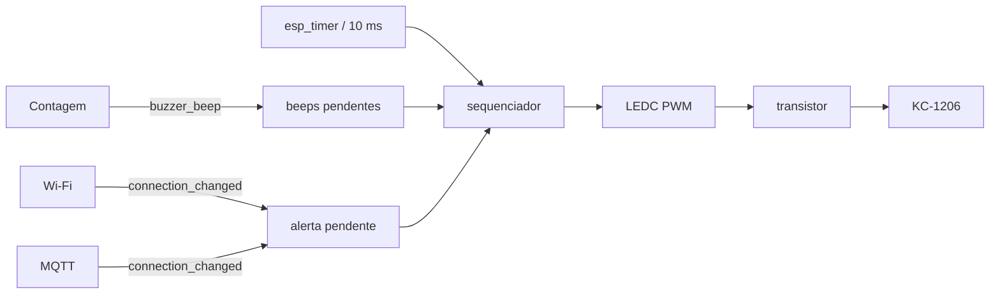

# Sinalização local

A sinalização local possui módulos independentes para o buzzer e para os LEDs verde e vermelho. O objetivo é fornecer retorno imediato ao operador sem bloquear a tarefa de contagem.

Voltar para a [documentação do firmware](../../README.md) ou para o [README principal](../../../README.md).

## Arquivos

```text
main/
├── include/indicators/buzzer.h
├── include/indicators/leds.h
├── src/indicators/buzzer.c
└── src/indicators/leds.c
```

## Hardware controlado

O firmware controla um buzzer passivo KC-1206 por PWM. No protótipo atual:

| Parâmetro | Valor padrão |
|---|---:|
| GPIO de comando | 45 |
| Frequência PWM | 2400 Hz |
| Resolução LEDC | 10 bits |
| Duty durante o som | 512/1023, aproximadamente 50% |
| Timer LEDC | 0 |
| Canal LEDC | 0 |

O GPIO não deve alimentar o buzzer diretamente. Ele deve comandar um transistor externo. Os LEDs usam saídas digitais próprias: verde no GPIO 1 e vermelho no GPIO 40, ambos ativos em HIGH, cada um com resistor em série e cátodo no GND. Remova a ligação antiga do LED ao estágio do buzzer. Consulte [docs/hardware.md](../../../docs/hardware.md) e [docs/buzzer.md](../../../docs/buzzer.md).

## Comportamentos sonoros

| Evento | Sinal |
|---|---|
| passagem válida | 1 beep de aproximadamente 60 ms |
| queda de Wi-Fi ou MQTT após já estar conectado | 3 pulsos de aproximadamente 180 ms |
| boot sem conexão | nenhum alerta |
| primeira tentativa de conexão | nenhum alerta |
| mesma indisponibilidade ainda ativa | não repete continuamente |

O alerta de queda é rearmado quando Wi-Fi e MQTT voltam a estar conectados.

## Arquitetura não bloqueante

`buzzer_beep()` não toca o som diretamente. A chamada apenas incrementa uma fila lógica de beeps pendentes e retorna imediatamente.

O PWM é controlado exclusivamente pelo callback periódico de um `esp_timer` com período de 10 ms.



Essa abordagem evita `vTaskDelay()` dentro da lógica de contagem e impede que callbacks de rede fiquem esperando um som terminar.

## Máquina de fases do buzzer

Internamente existem as fases:

```text
IDLE
COUNT_ON
COUNT_GAP
ALERT_ON
ALERT_GAP
```

Tempos nominais:

| Fase | Duração |
|---|---:|
| beep de contagem | 60 ms |
| intervalo entre beeps de contagem | 40 ms |
| pulso de alerta | 180 ms |
| intervalo do alerta | 120 ms |
| tick do sequenciador | 10 ms |

As durações são nominais. Um atraso de escalonamento pode estender um pulso, porque o callback não é uma fonte de temporização hard real-time.

## Prioridade entre sons

Alertas de conectividade têm prioridade sobre beeps de contagem pendentes.

Se ocorrer uma contagem durante os três pulsos do alerta:

1. a contagem e o evento são processados normalmente;
2. `buzzer_beep()` registra o beep pendente;
3. o beep é tocado depois que o alerta termina.

Uma contagem durante outro beep não prolonga o som atual; ela gera outro beep separado.

## Fila de beeps

O limite é:

```text
MAX_PENDING_BEEPS = 16
```

Se a fila lógica já possuir 16 beeps aguardando, `buzzer_beep()` retorna `ESP_ERR_NO_MEM`. O erro de sinalização não desfaz a contagem nem o evento de produção.

## Detecção de queda de conectividade

O módulo recebe notificações por:

```c
buzzer_connection_changed(BUZZER_CONNECTION_WIFI, connected);
buzzer_connection_changed(BUZZER_CONNECTION_MQTT, connected);
```

Para o alerta sonoro, uma queda só é considerada quando uma camada que estava conectada muda para desconectada. Assim, o boot offline não dispara o som. O LED vermelho, por sua vez, já indica a falta de conexão desde sua inicialização.

Como Wi-Fi e MQTT normalmente caem juntos, `outage_reported` agrupa o episódio em um único alerta. Quando ambas as camadas voltam a ficar conectadas, um novo episódio pode gerar outro alerta.

## Falhas do driver

Se `ledc_set_duty()` ou `ledc_update_duty()` falhar:

1. o erro é registrado;
2. o módulo tenta `ledc_stop()` para forçar a saída em LOW;
3. o sequenciador retorna para estado ocioso;
4. uma falha posterior de `ledc_stop()` é tentada novamente no próximo tick.

A aplicação não deve considerar o som como confirmação de que a contagem foi persistida no servidor.

## LEDs independentes

| Situação | Verde (GPIO 1) | Vermelho (GPIO 40) |
|---|---|---|
| boot aguardando Wi-Fi/MQTT | apagado | aceso |
| Wi-Fi e MQTT conectados, sem passagem | apagado | apagado |
| passagem válida após liberar o sensor | aceso por 100 ms | acompanha o estado de conexão |
| Wi-Fi ou MQTT desconectado | continua pulsando a cada passagem válida | aceso continuamente |
| comunicação desabilitada em `menuconfig` | continua pulsando a cada passagem válida | apagado |

O verde indica a **contagem local**, inclusive se o evento não puder ser entregue ao servidor. Uma peça mantida no sensor não gera pulsos repetidos. O vermelho apaga somente quando **Wi-Fi e MQTT** estão conectados; não representa a validade do relógio nem confirma o armazenamento dos eventos no servidor.

### API e temporização

`leds_init()` prepara as duas saídas. Depois, exclusivamente `app_main` chama:

```c
leds_update(product_counted, wifi_connected, mqtt_connected, now_us);
```

Os três primeiros argumentos são `bool`; `now_us` é `int64_t` e contém o tempo monotônico em microssegundos. `product_counted` deve ser verdadeiro apenas na iteração em que `counter_update()` retorna `COUNTER_COUNT`.

As duas funções retornam `esp_err_t`. Falhas de escrita do GPIO são informadas ao chamador e a saída é tentada novamente na próxima atualização; a contagem não depende do sucesso da sinalização.

Uma contagem define o instante em que o verde deve apagar. As chamadas seguintes comparam `now_us` com esse instante, sem `vTaskDelay()` e sem timer próprio. Se chegar outra contagem durante o pulso, a duração é renovada a partir dela. O loop atual chama a atualização aproximadamente a cada 10 ms; atrasos no escalonamento podem estender o pulso e a resposta do vermelho.

Os LEDs não dependem da fila de sons. Durante um alerta de rede, o verde pulsa imediatamente na contagem mesmo que o beep aguarde o fim do alerta. A sequência sonora existente permanece igual.

## Configuração

No menuconfig:

```text
FlowCount - buzzer KC-1206
```

Opções:

- `FLOWCOUNT_BUZZER_GPIO`, padrão 45;
- `FLOWCOUNT_BUZZER_FREQUENCY_HZ`, padrão 2400 Hz.

As opções dos LEDs são:

- `FLOWCOUNT_LED_GREEN_GPIO`, padrão 1;
- `FLOWCOUNT_LED_RED_GPIO`, padrão 40;
- `FLOWCOUNT_LED_PULSE_MS`, padrão 100 ms.

Os GPIOs dos LEDs devem ser distintos e não podem compartilhar a saída do buzzer, a entrada do sensor ou pinos usados por outros periféricos. Veja as [particularidades de GPIO1 e GPIO40 na Heltec](../../../docs/hardware.md#leds-independentes).

GPIO45 é um pino de strapping do ESP32-S3. O circuito externo não deve forçar um nível inadequado durante reset/boot. A montagem deve ser validada na placa Heltec utilizada.

## Validação em bancada

1. ligue o sistema e confirme no serial o log de inicialização do buzzer;
2. não espere beep durante o boot;
3. passe uma peça válida e confirme um beep curto;
4. mantenha uma peça parada no sensor e confirme que não surgem beeps repetidos;
5. com Wi-Fi e MQTT conectados, derrube o broker e confirme três pulsos;
6. mantenha a indisponibilidade e confirme que o alarme não fica repetindo;
7. reconecte tudo, derrube novamente e confirme que o alerta foi rearmado;
8. se não houver som, meça primeiro o GPIO/PWM e depois o estágio do transistor.

Para os LEDs:

1. inicialize sem rede e confirme o vermelho aceso e o verde apagado;
2. conecte Wi-Fi e MQTT e confirme que o vermelho apaga;
3. passe e libere uma peça válida: o verde deve acender por aproximadamente 100 ms;
4. derrube somente o broker: o vermelho deve permanecer aceso após os três pulsos sonoros;
5. conte uma peça offline e confirme o pulso verde com o vermelho ainda aceso;
6. restabeleça ambas as conexões e confirme o vermelho apagado;
7. teste com `FLOWCOUNT_COMM_ENABLED=n`: contagem e verde continuam funcionando, vermelho apagado.

## Testes relacionados

- `tests/test_buzzer.c` valida PWM, duração, alertas, reconexão, fila e falhas do driver;
- `tests/test_network_alerts.c` valida a integração das notificações de Wi-Fi/MQTT.
- `tests/test_leds.c` valida estados de conexão, pulso verde, comunicação desabilitada, configuração de pinos e falhas de GPIO.

Consulte [tests/README.md](../../../tests/README.md).
