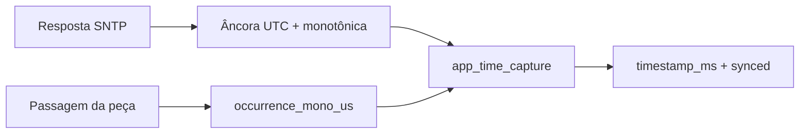

# Horário, SNTP e timestamps

O módulo `app_time` fornece horário UTC para os eventos de produção sem fazer a tarefa de coleta depender da disponibilidade da rede.

Voltar para a [documentação do firmware](../../README.md) ou para o [README principal](../../../README.md).

## Arquivos

```text
main/
├── include/time/app_time.h
└── src/time/app_time.c
```

## Objetivo

O FlowCount precisa preservar o horário em que a peça realmente passou pelo sensor. Usar o horário em que a mensagem chegou à Raspberry seria incorreto quando existe backlog de rede.

Ao mesmo tempo, o ESP32 pode iniciar sem internet ou levar alguns segundos para obter uma referência UTC. Por isso o módulo separa:

- tempo monotônico do ESP32, disponível desde o boot;
- uma referência UTC obtida por SNTP;
- reconstrução do UTC da ocorrência a partir desses dois valores.

## Princípio de funcionamento

Quando o callback SNTP recebe uma referência considerada válida, o módulo guarda um par de âncoras:

```text
mono_anchor_us = tempo monotônico do ESP32
utc_anchor_us  = UTC correspondente àquele instante
```

Para um evento posterior ocorrido em `occurrence_mono_us`:

```text
elapsed_us = occurrence_mono_us - mono_anchor_us
UTC_evento = utc_anchor_us + elapsed_us
```

O resultado é convertido para milissegundos e armazenado no próprio evento.



## Inicialização

`app_time_init()` é chamada no começo do boot, antes da rede.

Ela:

- valida a configuração do servidor NTP e a janela de validade;
- marca o módulo como inicializado;
- não cria rede;
- não espera sincronização;
- mantém o sistema em `CLOCK_UNSYNCED`.

Isso evita bloquear a coleta por causa de horário.

## Início do SNTP

`app_main` só chama `app_time_start_sntp()` depois que o Wi-Fi possui IP.

A configuração utilizada é não bloqueante:

```text
wait_for_sync = false
smooth_sync = false
```

Em caso de falha ao iniciar, `app_main` espera aproximadamente 5 segundos antes de tentar novamente.

Depois de inicializado com sucesso, o lwIP/SNTP realiza as atualizações periódicas conforme a configuração do ESP-IDF.

## Validação da referência

O callback rejeita referências que apresentem situações como:

- ponteiro de notificação inválido;
- falha em `gettimeofday()`;
- data anterior a 2020-01-01;
- valores inválidos de microssegundos;
- overflow aritmético;
- leitura da referência levando mais de 10 ms;
- tempo monotônico aparentemente retrocedendo durante a captura.

Uma referência rejeitada coloca o módulo como não sincronizado.

## Imutabilidade dos eventos

O timestamp é capturado quando o evento é criado.

Se uma peça for contada antes da sincronização:

```text
clock_synced = 0
timestamp_ms = 0
```

Se o relógio sincronizar 30 segundos depois, esse evento antigo permanece sem UTC. O módulo não modifica a fila retroativamente.

Da mesma forma, uma correção posterior do relógio não altera timestamps já copiados para eventos anteriores.

Essa política evita inventar um horário para ocorrências que aconteceram antes de existir uma referência confiável.

## Validade da âncora

A referência não é usada indefinidamente. A opção:

```text
FLOWCOUNT_CLOCK_MAX_AGE_SECONDS
```

possui padrão de 86400 segundos, ou 24 horas.

Se o tempo desde a última referência ultrapassar esse limite, novas capturas passam a retornar `synced=false` até uma nova sincronização válida.

O Kconfig também exige que essa janela seja maior que o intervalo normal de atualização do SNTP.

## Diagnóstico periódico

`app_time_poll()` é chamada pela tarefa principal e limita seus próprios diagnósticos a aproximadamente uma vez por segundo.

Situações relevantes:

| Situação | Log esperado |
|---|---|
| boot antes do SNTP | `CLOCK_UNSYNCED` |
| sincronização válida | `CLOCK_SYNCED` |
| SNTP iniciado, mas sem referência após 60 s | aviso de timeout |
| referência que envelheceu além do limite | aviso de referência vencida |

Os avisos de timeout/expiração não são impressos em todos os ciclos.

## Formato enviado ao servidor

O evento mantém `timestamp_ms` em Unix UTC. Na camada MQTT, esse valor é convertido para ISO 8601, por exemplo:

```text
2026-09-11T21:00:00.123000Z
```

A precisão interna do evento é de milissegundos. O serializador adiciona os três zeros restantes para produzir uma fração com seis casas no texto.

O fluxo Node-RED do servidor recebe `ts` como horário do evento. Preserve a fração de segundo durante o processamento para manter a precisão temporal; a identificação para deduplicação utiliza `evt_id`, conforme o [protocolo de comunicação](../communication/README.md).

## Configuração

No menuconfig:

```text
FlowCount - horario dos eventos
```

| Configuração | Padrão | Descrição |
|---|---|---|
| `FLOWCOUNT_NTP_SERVER` | `pool.ntp.org` | host ou IP do servidor SNTP |
| `FLOWCOUNT_CLOCK_MAX_AGE_SECONDS` | `86400` | tempo máximo para considerar a referência válida |

O servidor pode ser substituído por uma fonte NTP local na rede da fábrica, desde que acessível ao ESP32.

## Relação com a comunicação

O relógio não é requisito para reconhecer fisicamente uma passagem. Porém, o fluxo de comunicação atual exige um timestamp válido para serializar o evento.

`communication_process_once()` descarta um evento sem UTC ao encontrá-lo na cabeça da fila, evitando que ele bloqueie eventos posteriores.

Consequência prática: após boot, é recomendável aguardar o log `CLOCK_SYNCED` antes de iniciar uma medição em que nenhuma perda lógica seja aceitável.

## Cenários de falha

### Wi-Fi indisponível no boot

A coleta inicia normalmente. SNTP não é iniciado até o Wi-Fi obter IP.

### Servidor NTP inacessível

A coleta continua. Após 60 segundos com o SNTP iniciado e sem referência válida, o firmware registra um aviso.

### Relógio sincroniza depois de algumas contagens

Eventos antigos permanecem sem UTC. Novos eventos passam a receber timestamp.

### Relógio é corrigido para trás

A correção afeta somente novas capturas. Eventos já criados permanecem imutáveis.

### Referência fica velha

Após `FLOWCOUNT_CLOCK_MAX_AGE_SECONDS`, novas capturas voltam a ser inválidas até nova sincronização.

## Testes relacionados

`tests/test_app_time.c` cobre:

- boot não sincronizado;
- chamada de SNTP antes da inicialização;
- falha e nova tentativa de SNTP;
- timeout de 60 s;
- captura antes e depois da sincronização;
- imutabilidade de timestamps;
- correção do relógio;
- expiração da referência;
- datas inválidas;
- falha e atraso excessivo de leitura.

Consulte [tests/README.md](../../../tests/README.md).
